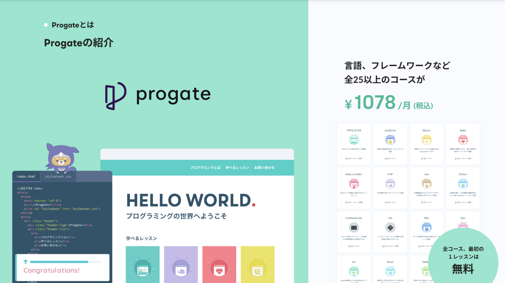
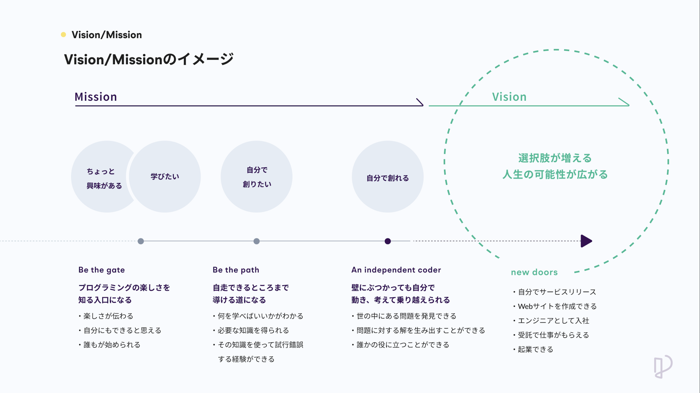
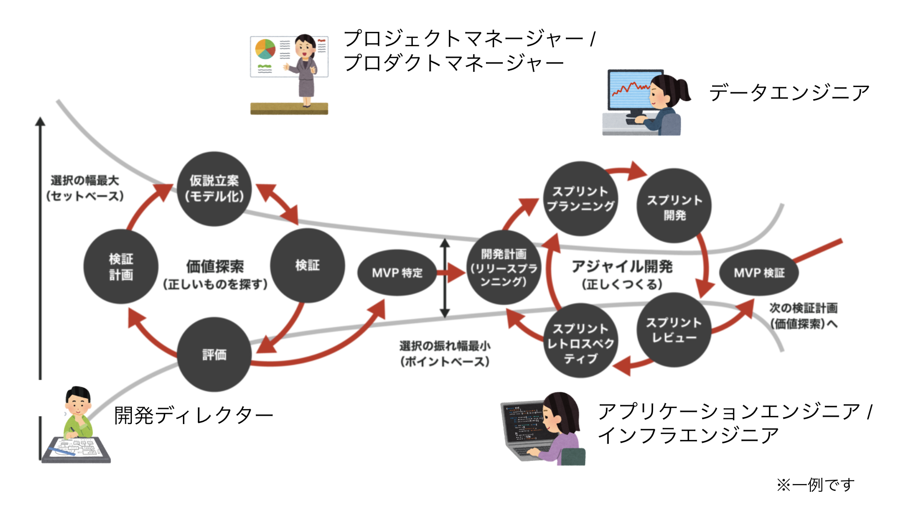

# エンジニアの多様性
2022/02/28
Kazuki Maeda @Progate 

---
### Contents
1. 自己紹介
2. 会社/事業紹介
    - Column:グローバルでのエンジニア市況
3. エンジニア職の多様性
    - キャリア紹介
    - これまで経験したエンジニア系職種
    - 各職種の関わり方
4. まとめ・質疑応答

---
# 自己紹介

---
### Kazuki Maeda
Engineer Manager [@kzk_maeda](https://twitter.com/kzk_maeda)
 
日系電気メーカーで知財法務
→リクルートにてインフラ・クラウドエンジニア・PMなど
→Progateにてエンジニアマネージャー
 
AWS Community Builder / AWS Startup Community Core Member

---
### Kazuki Maeda

だいたいオフの日は子どもに潰されています

---
### Kazuki Maeda

コミュニティの活動もやってます

---
## 会社紹介

---

---

---

---

---

---
より詳細なアーキテクチャなど知りたい方は、去年AWSのイベントに登壇したときの資料を公開しているので是非！
- https://speakerdeck.com/progate/aws-dev-day2021
- https://www.youtube.com/watch?v=6Uc5m2HF-xs

---
### column: グローバルでのエンジニア市況

---

### 再掲

---
海外、特にインドのエンジニア市況

- インドではカースト制度突破の選択肢としてITエンジニアを志望する若者が多い
- IITと呼ばれるトップ工科大学出身者は世界中で引き合いが強い
- グローバルビッグテック企業のトップにインド出身者が就くケースが増えている

---
弊社ワークショップの例
※別資料参照

---
## エンジニア職の多様性

---
**質問です**
 
「ITエンジニア」と聞いて、どのようなイメージを持ちますか？

---

---
一口に「ITエンジニア」と言っても、その実態は色々
 
私のキャリアを振り返りながら
経験してきたエンジニア系の仕事を紹介します

---
**概略**
- 大学〜大学院
- 1社目：Panasonic
- 2社目：リクルート
- 3社目：Progate

---
## 大学〜大学院

---
- 最初にプログラミングに触れたのは、大学の授業でC言語に触れた時
- 正直あんまり記憶にありません
- 学部の研究でロボットシミュレーションが必要になり、Cを再履修して初めての動くプログラムを書きました
- 大学院では流体力学の数値計算をFortranで行い、スーパーコンピュータを用いた並列演算処理をやってました
- それなりに楽しかったものの、所謂「ソフトウェア工学」的な勉強などはせず

---
## 1社目

---
- 新卒で入ったPanasonicで知財法務（特許とか）の部署に配属されました
- めちゃくちゃエンジニアっていう仕事ではないのですが、広く技術理解力が求められる上での法対応業務なので、エンジニアのキャリアパスとして可能性はあるとは思います
- が、特に多くは語れません

---
## 2社目

---
- 第二新卒枠でリクルートに未経験エンジニアとして入社しました
- ここで幸いにもいろんなエンジニア系の仕事を経験できました
    - インフラエンジニア
    - クラウドエンジニア
    - データエンジニア
    - アプリケーションエンジニア
    - 情報システムエンジニア
    - 開発ディレクター
    - プロジェクトマネージャー
- 順番にどんな仕事だったか個人の感想ベースで紹介します

---

## インフラエンジニア

---
### インフラエンジニア
- サマリ
  - システムの根幹を支えるインフラの構築・運用
- 業務例
  - 物理サーバの設置・配線・設定
  - ネットワーク設計、OS設計、DB設計
  - システム運用（アラート対応など）

---
### インフラエンジニア
- ポイント
  - Webサービスがユーザーに届くまでの根幹に携われる
  - 大規模なプロジェクトやシステムに関わることが多い
- スキル
  - OS/ネットワーク/ミドルウェア/セキュリティなど
  - ITIL、ITサービスマネージャーなどの体系知識

---

## クラウドエンジニア

---
### クラウドエンジニア
- サマリ
  - パブリッククラウドサービスを活用し、システム設計・開発を行う
- 業務例
  - パブリッククラウド（AWS、GCPなど）を用いた基盤設計・構築
  - クラウドリソースのコード管理
  - システム運用（アラート対応など）

---
### クラウドエンジニア
- ポイント
  - 次世代のインフラスタンダードになりつつあるクラウドの知見を習得できる
  - コミュニティも活発で、技術進歩が早い
  - インフラ、アプリケーション、MLなど活躍の場が多岐にわたる
- スキル
  - パブリッククラウド関連の知識（AWS、GCP、Azure・・）
  - インフラリソースのコード管理（IaC: Infrastructure as Code）

---

## データエンジニア

---
### データエンジニア
- サマリ
  - プロダクト・サービスが収集する種々のデータを活用できる状態にする
- 業務例
  - データ収集システム基盤の設計・構築
  - 分析用データの整形処理

---
### データエンジニア
- ポイント
  - クラウドサービスを利用するケースが多く、クラウドエンジニアからの転身も多い
  - BigData/ML/AIに必須の職種
- スキル
  - パブリッククラウド関連の知識（AWS、GCP、Azure・・）
  - インフラリソースのコード管理（IaC: Infrastructure as Code）
  - データ処理関連の知識（ETL/ELT、複雑なSQL、データパイプライン・・）

---

## アプリケーションエンジニア

---
### アプリケーションエンジニア
- サマリ
  - 実際のプロダクションコードを書き、運用する
  - 多分一番「エンジニア」のイメージに近いやつ
- 業務例
  - アプリケーションコードの実装
    - フロントエンド、バックエンド、ネイティブアプリなどのレイヤがある
  - 仕様決定や設計のためのミーティングなど、話す仕事や文書を書く仕事も多い

---
### アプリケーションエンジニア
- ポイント
  - 書いたコードがサービスとして世の中にリリースされる喜びを一番感じられる仕事（かもしれない）
- スキル
  - プログラミングスキル（いろいろな言語への適応など）
  - 設計・アーキテクチャ・デザインパターンに関する知見
  - アルゴリズム・データ処理に関する知見

---

## 情報システムエンジニア

---
### 情報システムエンジニア
- サマリ
  - 従業員が利用するデバイスやITツールの管理運用
- 業務例
  - 従業員利用端末の手配・キッティング・セットアップ・セキュリティ対策
  - 共通ITツール（Slackとか）の管理運用
  - 社内ネットワーク・ファシリティ環境の整備

---
### 情報システムエンジニア
- ポイント
  - 従業員が業務に集中できる環境を整え、維持する
    - 情シスがいないとみんな仕事になりません
  - 意外と必要な技術スキルは多岐にわたる
- スキル
  - PC（Windows/Mac）のキッティング・セットアップ・管理運用関連知識
  - 社内セキュリティ・ガバナンスに関する知識

---

## 開発ディレクター

---
### 開発ディレクター
- サマリ
  - 開発案件の仕様策定やチーム間折衝コントロール
- 業務例
  - プロダクト開発案件の要求仕様化
  - プロダクトオーナー・エンジニア・デザイナーなどと調整して開発案件を前に進める

---
### 開発ディレクター
- ポイント
  - エンジニアリングのバックグラウンドを持って、より上流から携われる
  - 世に出る機能について、生みの親感を感じることができる
- スキル
  - 開発・デザイン・QAなどプロダクト開発に必要な幅広い知識
  - 文書化能力、コミュニケーション能力

---

## プロジェクトマネージャー

---
### プロジェクトマネージャー
- サマリ
  - 数ヶ月〜年単位で複数人が関わるプロジェクトのマネジメント
- 業務例
  - プロジェクト立ち上げ、スコープ策定、メンバー巻き込み
  - QCDS管理、リスク管理、スケジュール管理、タスク管理

---
### プロジェクトマネージャー
- ポイント
  - エンジニアリングのバックグラウンドを持って、より上流から携われる
  - 大きなスコープの開発案件を統括することができる
- スキル
  - プロジェクトマネジメントの専門スキル
  - 開発・デザイン・QAなどプロダクト開発の幅広い知識
  - 文書化能力、コミュニケーション能力

---
各エンジニアロールがどう関わっているのかも話したいのですが
一旦次のキャリア紹介に行きます

---
## 3社目

---
- 2020/8に現職のProgateに転身しました
- 最初はこれまで一番経験があったクラウド・データエンジニアとして開発に携わっていたのですが、2021/1から開発組織全体のマネージャーをすることになったので、その紹介を挟みます

---

## エンジニアマネージャー

---
### エンジニアマネージャー
- サマリ
  - エンジニア組織の活性化、開発に集中できる組織設計など
  - エンジニアがエンジニアとして働けるためにすべきことはなんでもする人
- 業務例
  - 開発計画・ロードマップの策定
  - 開発組織設計
  - メンバーとの1on1、評価。採用などの組織運営活動

---
### エンジニアマネージャー
- ポイント
  - 多くのエンジニアが活躍できる場を作り、より大きな成果の達成をチームで目指す
- スキル
  - 開発関連の知識全般（プログラミングだけでなく、基盤や開発プロセスなど）
  - 組織心理学やコーチングなどの知見
  - サーバントシップ力

---
## 他のエンジニア系職種

---
- QAエンジニア
- ブリッジSE
- セールスエンジニア
- サポートエンジニア
- ソリューションアーキテクト
- アドボケイト、エバンジェリスト
- プロダクトマネージャー
- VPoE/VPoP
- CTO/CIO
- ・・・・・

---
「エンジニア」と呼ばれる職種の多様性は高いです
 
定義の差などにも起因して、エンジニア系職種は無限に増殖しています

---
それぞれに得意な領域、専門とする領域があります
 
それぞれ必要なスキルや特性は変わってくるので、自分に合った職種を探して専門性を磨くのが大事！
アンテナを常に張っておくことも！

---
## エンジニア職同士の関わり

---
### Phaseによる関わり（例：ウォーターフォール型）

---

---
### 開発手法による関わり（例：スクラム開発）

---

---
組織の形や開発プロセスによりますが、
 
我々エンジニアは異なる専門性のメンバーと協力しながら、みんなでプロダクトづくりに取り組んでいます！

---
## まとめ

---
- 市況
  - グローバル市況において、エンジニアの競争力は上がってきています
- エンジニアの多様性
  - 一口に「エンジニア」と言っても、その職種はたくさんあります
  - 職種ごとに特性も必要スキルも様々なので、実際の開発でいろいろ経験すると希望の職種が見つかるかも
  - 何においても開発に関する知見を持っていて損することはないので引き続き頑張ってください！

---
## 質疑応答