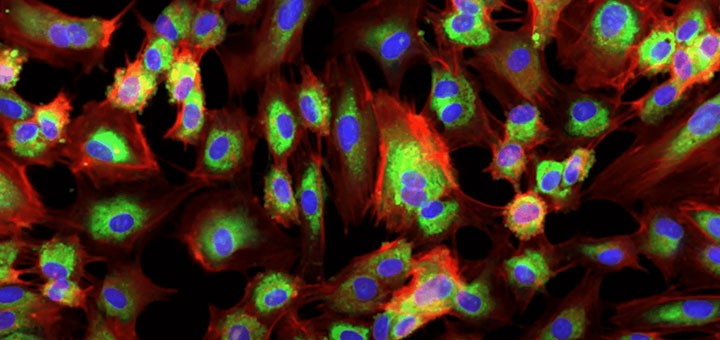
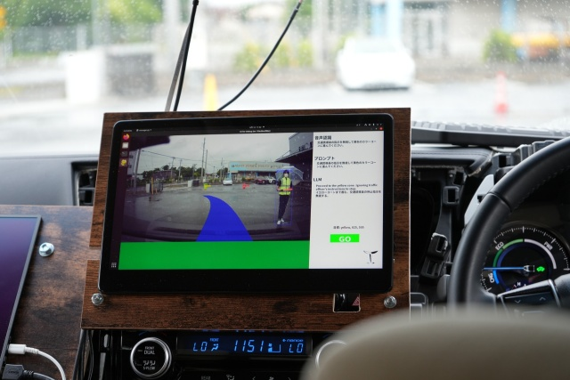

# 生成AIによって変わる世界

### 可能性とリスクについて考える

---
<!-- header: イントロダクション -->
# イントロダクション

---

# 自己紹介

- 前田 和樹
- atama plus株式会社 Engineer Manager
- データや機械学習、生成AIに関する開発

---

# クイズ 
<!-- https://vdata.nikkei.com/newsgraphics/ai-art/ -->

---

---

---

---

# 触ってみよう

---

<!-- header: 生成AIの種類と活用-->
# 生成AIの種類と活用

---
## テキスト生成
### 概要
- 与えられた命令（prompt）に応じて自然言語のテキスト、文章を生成する技術

### 主なツール
- ChatGPT、Geminiなど

---

## テキスト生成の活用例
### チャットボット
Webサイトなどの問い合わせ対応の裏側で活躍

### コンテンツ生成
記事、ブログなどの文章コンテンツの自動生成

### コーチング
アイデアや困りごとの相談、解決支援

---
## 画像・動画生成
### 概要
- 与えられた命令（prompt）に応じて画像や動画を生成する技術

### 主なツール
- ChatGPT（旧 DALL-E）、Stable Diffusionなど

---

## 画像・動画生成の活用例
### 広告とデザイン

バナーやプロモーション素材の自動生成。
#### アートとエンターテイメント
AIアートやキャラクターデザインの制作。

### 映像制作
動画や映画のシーン生成、特撮の補助。

---
## 実際に活用されはじめている事例
みなさんの身近で生成AIが活用されている事例の紹介

---
## メルカリ

### メルカリAIアシスト
- メルカリの利用シーンにおいてAIが支援
- 商品が売れるよう出品者に改善提案を行う機能

---
## マクドナルド

### プロモーション動画の生成
- 生成AIを用いて制作したプロモーション動画をXで公開
- 一部で批判的な反応も

---
## コカコーラ

### Create Real Magic
- 生成AIを用いて自分だけのクリスマスカードを制作
- 消費者参加型広告に生成AIによるオリジナリティを組み合わせた事例

---
## 教育分野での活用事例

---
## レアジョブ

### AIレッスンレポート

- 英会話レッスン後の復習を効率化するサービス
- 他にもAIが自動採点を行うスピーキングテストサービスなども提供

---
## ベネッセ

### 自由研究おたすけAI
- 小学生向けに自由研究のテーマ選定や子供達の疑問に対するアドバイスを提供

---
## atama plus

### 桃太郎 / AIステップ解説（β）

---
## より発展的な生成AIの活用事例
実際に産業や学術の世界を変えつつある生成AIの活用事例

---
## 創薬業界

### NVIDIA BioNeMo
- タンパク質構造予測やタンパク質配列生成を可能とする生成AI
- 創薬にかかる研究開発スピードの短縮を狙う

---
## 自動運転業界

### Turing Heron
- 完全自動運転に向けた柔軟な状況判断を生成AIで実現しようとしている
- 複雑な現実世界を理解し、人間のように考えて判断することを目指す

---

<!-- header: 生成AIのしくみ -->
# AIと生成AIの仕組み

---
## AIとは何か
- コンピューターが人間のように考えたり（考えているように見えたり）、学んだりできる技術
- 生成AI以前から実生活に多く利用されている
- たとえば
  - スマホの顔認識機能
  - Amazonのおすすめ商品
  - 機械翻訳

---
## AIの歴史
- **1950年代**: アラン・チューリングが「機械は知能を持てるか？」という問いを提起。ここからAIの研究がスタート。
- **1980年代**: ルールベースのエキスパートシステムが主流。特定の知識に基づいて問題解決を行うAI。
- **2000年代**: 機械学習と大量のデータを利用したAIが注目を集める。特に、データ解析の分野で活躍。
- **2010年代**: ディープラーニング（深層学習）が大きな飛躍を遂げ、AIが画像認識や自然言語処理で急速に進化。

---
## AIは言語を学習できるのか？：記号設置問題
- そもそも人間はどうやって言語能力を習得するのか？
  1. はじめは周囲の大人が話す言葉をじっと聞いている
  2. 徐々に言葉と概念を紐付け始める（オノマトペ）
  3. 徐々に単語が増え、複数の単語を繋げ、やがて文章をつくる
- この過程において、「単語」と「現実世界の概念」との関係を学習する
  - これを「**記号設置問題**」と呼ぶ
- 詳細な言語獲得プロセスに関してはまだまだ謎が多い

---
## AIは言語を学習できるのか？：形態素解析
- 言語処理はAIの研究分野の一つ、自然言語処理として発達
- 文の構造や意味を考える前に単語を認識する必要があり、意味を持つ最小単位に分割する「**形態素解析**」が発達
- 分割した単語を構文解析などで分類
 

---
## AIは言語を学習できるのか？：形態素解析

簡単なプログラムで形態素解析の動きを見てみましょう

---
## AIは言語を学習できるのか？：機械学習
- 初期のAIは専門家が辞書やルールを作り、それらを機械に読み込ませていた（**エキスパートシステム**）
  - 一定規模以上の知識になると、人間が入力することに限界があった
- 2000年代から、機械が自ら学習する手法が台頭（**機械学習**）
  - コンピューターの性能が劇的に進化した
  - インターネットにより学習可能なテキストデータが大量に手に入るようになった

--- 
## AIは言語を学習できるのか？：機械学習の限界
- 機械学習の活用を進めても、機械に言語を学習させるのは難しかった
  - 目的別の学習用データを大量に用意する必要がある
  - 学習効率が悪い（人間と比べて）
  - 目的が明確でない場合、学習用データの用意もできない
- 人間の言語習得プロセスもまだ謎が多いので、それを機械に習得させるのは難しい

---
## 生成AIの登場まで：シャノンの情報理論

- 1948年、クロード・シャノンという科学者が「**情報理論**」を提唱
- 情報を「**ビット**」という数値に変えることで、言葉から意味をなくし、言葉を確率的に扱えるようになった
- **情報量**：高確率で使われる言葉の情報量は大きく、低確率で使われる言葉の情報量は小さく扱う

---
## 生成AIの登場まで：
### 言語モデル
 

- 情報を言葉に適用し、文章を構成する際に、意味ではなく、次に来る確率が高い単語を選択することで文章を生成できる
- **言語モデル** : 文に対して確率を割り当てることができるモデル

---
## 生成AIの登場まで：
### 言語モデル
 

簡単なプログラムで言語モデルの動きを見てみましょう

---
## 生成AIの登場まで：言語モデル

- 補足: 言語モデルでは言葉をベクトルとして捉えている

---
## 生成AIの登場まで：学習する言語モデル

- 言語モデルを巨大にして、確率的に単語の推測が可能な状態を目指す
  - インターネットにある学習データを用いて機械が自分で問題を設定し、自分で答え合わせする（自己教師あり学習）
- 言葉の意味は分からずとも、インターネットにある膨大な量のデータを全て数字と確率で処理できるようになる
- こうして作られた言語モデルは、言葉の意味を捨て、前の単語から後の単語を確率的に予測できるようになる

---
## 生成AIの登場まで：（補足）画像や音楽への転用

- ここまで話してきたテキストに対する言語モデルと同様に、画像や音楽でも、それぞれを数値データとして扱い、次に来るデータを確率的に予測するモデルを作成することができる
- 大まかな原理は、テキストの際と変わらない

---
## 生成AIの登場まで：ここまでのまとめ
- **記号設置問題**
- **形態素解析**
- **シャノンの情報理論**
- **言語モデル**

---
## 生成AIの登場まで：ここまでのまとめ
- **記号設置問題** : 「単語」と「現実世界の概念」との関係をどうやって結びつけるか
- **形態素解析** : 文章を意味を持つ最小単位に分割する
- **シャノンの情報理論** : 情報を数値に変えることで、言葉から意味をなくし、言葉を確率的に扱う
- **言語モデル** : 文に対して確率を割り当てることができるモデル

---
## 生成AIの登場まで：ここまでのまとめ
言葉から「意味」をなくし、全て「数値」と「確率」で扱えるようになった

---
## 生成AIの登場：大規模言語モデル

- インターネット上の大量のデータと、コンピューターの性能をフル活用して言語モデルの拡張に関する研究が近年盛んに行われてきた
- 代表的な企業が、OpenAI（米）、Anthropic（米）、Google（米）、Meta（米）

---
## 生成AIの登場：大規模言語モデル

- 学習に用いるデータ量と、学習自体の複雑さを示すパラメータ数が劇的に進化することで、言語モデルは大規模言語モデルに進化し、圧倒的な性能を示すようになった

 

| 名称 | 企業名 | 訓練データ量 | パラメータ数 | 発表年 |
|---|---|---|---|---|
| GPT-1 | OpenAI | 4.5 GB | 1.2 億 | 2018年 |
| GPT-2 | OpenAI | 40 GB | 15 億 | 2019年 |
| GPT-3 | OpenAI | 570 GB | 1750億 | 2020年 |
| GPT-4 | OpenAI | 1500 GB（推定） | 数千億 ~ 数兆 | 2023年 |

---
## 生成AIの登場：大規模言語モデル

- データ量とパラメータ数を大きくするには、その分膨大なコンピューターが必要
- お金と時間をかけて各社競い合うようにモデルを進化させている
- 一つのモデルに対し、数十億円以上のお金がかかっていると言われる

---

---
## 生成AIの登場：大規模言語モデル

### どのくらいのデータとパラメータを与えるといいのか？

- 訓練データを増やせば増やすほど、
- パラメータ数を大きくすればするほど、
- コンピューターにたくさん計算させればさせるほど、

言語モデルの性能は改善されていくということがわかった（**べき乗則**）

---
## 生成AIの登場：大規模言語モデル

- モデルを大きくすると、徐々に性能が改善するだけでなく、ある規模になると急にこれまで解けなかった問題が解けるようになる現象が観測されている（**創発**）
  - 数十億パラメータでは解けなかった問題が、数百億パラメータになると急に解けるようになる、など
- この現象が発生する理由については、未だ解明されていない

---
## 生成AIの登場：
### 大規模言語モデルと生成AIの違い

- **大規模言語モデル** :
  言葉の確率的な振る舞いを決める知能
- **生成AI技術** :
  テキストに限らず、画像や音楽を生成する技術
- **生成AIサービス** :
  生成AI技術を使いやすい形のサービスとして提供

---
## 生成AIの登場：ここまでのまとめ
- 言語モデルを実用可能なレベルまで拡張するため、各社が莫大な時間とお金を投資して大規模化したものを大規模言語モデルと呼ぶ
- 大規模言語モデルは、データやパラメータを増やせば増やすほど高性能化していくことが知られている（**べき乗則**）
- また、ある一定の規模になると、それまで解けなかった問題が突然解けるようになる現象も観測されている（**創発**）
- 大規模言語モデルなどの生成AI技術を一般に利用しやすい形で提供しているのがChatGPTなどのサービス

---
# 触ってみよう②

---
<!-- header: 休憩-->
# 休憩・疑問解消タイム

---
<!-- header: 生成AIとリスク-->
# 生成AIとリスク

---
## 情報の信憑性
- ここまで述べたように、生成AIは厳密な知識をもって解答を生成しているわけではない
- 従って、正しくない情報が生成されることがある（**幻覚・ハルシネーション**）
- 幻覚により生成された誤った情報が、人間や、専門家でさえも区別できないこともある

---
## 情報の信憑性：事例
### 三豊市の「ごみ出し案内」へのChatGPT活用
- 東大松尾研と三豊市が共同で行った実証実験
- 市民からのゴミ出しルールなどの問い合わせにChatGPTで解答する仕組みを検討
  - *脱線：ここでChatGPTと呼んでいるのが正しいかどうか考えてみよう*
- 正答率は94%ほどであったが、5%以上も正しくない情報が出力されるため、市の業務としては利用できないと判断し、断念した
- https://www.city.mitoyo.lg.jp/kakuka/shiminkankyou/eisei/2/chatGPT/index.html

---
## プライバシーの問題
- ChatGPTなどの生成AIサービスは、何を聞いても即座に答えてくれるので、人には言えないことの相談相手として使われることもある
- 一方で、生成AIサービスを提供している会社は、誰がどんな内容を書き込んだのかのデータを保有することとなる
- また、一部の生成AIサービスは、ユーザーからの入力を基にさらに学習することで精度を上げていくものもある
- プライベートな相談が言語モデルに組み込まれ、知らない誰かに届いてしまう可能性も・・

---
## プライバシーの問題：事例
- OpenAI社は、ChatGPTで行われた会話データは、自社の言語モデルの再学習に利用するポリシーとしている
- 学習への利用を望まない場合、自身で学習させない設定をする必要がある
- Anthropicなど、ユーザーのデータをモデルの学習に再利用しないポリシーの会社もあるので、利用しているサービスのポリシーを理解しておくことが大事

---
## プライバシーの問題：事例
- ChatGPTで、自分以外のユーザーの会話履歴の一部が見れてしまうバグが発生
  ※現在は修正済み
- OpenAI社は「会話に個人情報をを共有しないよう」に呼びかけている
- https://japan.cnet.com/article/35201548/

---
## 法律的な問題
- 生成AIによって生成されたテキストや画像などの権利（著作権）の帰属や、その生成責任について問題となるケースがある
  - 生成AIに指示して作成させた画像の著作権は、指示した人に帰属するのか？
  - その画像が誰かの著作物と類似している（著作権を侵害しているとみなされる）場合、その責任は支持した人が負うべきなのか？
- 生成AIと著作権の問題はまだ議論の過渡期にある
  - 日本の著作権法上では、AIが生成した画像には著作権がないとの見方が強い

---
## 法律的な問題：事例

- 生成AIで生成された、模倣イラストがインターネット上に無数に存在している
- https://vdata.nikkei.com/newsgraphics/ai-anime/

---
## 倫理的な問題

- 大規模言語モデルの学習データには、多様な価値観や偏見をもったデータが含まれている
- そういったデータを学習しモデル化された大規模言語モデルは、時に偏見や誤った価値観に基づいた発言を生成する恐れがある
- 大規模言語モデルはどのような価値観を持つべきか？利用者は出力をどう取り入れるべきか？

---
## 倫理的な問題：事例

- （生成AIより前の事例）AmazonのAIを用いた採用プロセス
- 履歴書審査において、Amazonにより適した人を選別する際にAIを用いた審査を実施
- この時、過去にAmazon（特に開発職において）では男性を採用することが多かったことから、AIが女性に対して不利な判定を行っていたことが判明した
- 現在はAIを用いた審査は実施されていない

---
## 本人の証明の難しさ

- 生成AIにより、誰かに似せた声や見た目で本人とは全く関係のない発言を行わせたりすることも簡単にできるように
  - **ディープフェイク**と呼ばれる
- 有名人に本人の思想とは無関係な過激な発言をさせたり、非常に精巧な詐欺サイトを作成することも可能
- インターネットで簡単に得られる情報が、本当に正しい情報なのか見極める責務が利用者により強く求められる

---
## 本人の証明の難しさ：事例

- 岸田総理の動画を悪用したフェイク動画がYoutubeなどに拡散
- これを機に都知事選に立候補した安野さんと岸田総理が意見交換するなど、専門家による対策検討が急がれている

---
## 産業構造への影響

- 生成AIが多くの職業の生産性を向上させる期待がある一方、雇用消失や格差拡大といった懸念もある
- 生成AIが得意な領域の多くを担う職種に対しては、業務の90%以上が自動化される可能性がる、という研究も

---
<!-- header: 生成AIとどう向き合っていくか-->
# 生成AIとどう向き合っていくか

---
## AIは道具であると認識する
- あくまでもAI・生成AIは道具である、という認識のもとで利用する
- 道具である以上、その道具の使い方に習熟する必要はあり、使い方を間違えると逆効果を生むこともある

---
## AIにできることを見極める
- 生成AIは数字で確率的にテキストや画像を生成するもので、知識を持っているわけでもなく、間違いを起こすことも十分にある
- AIは与えられたデータからルールを発掘したり、判断したりすることは得意なので、道具としてのAIに如何にデータを与え、判断させるか、最終的な決定は人間に帰属させるか、といった使い方を意識する

---
## 人間らしい複雑な問題に挑戦する
- 世の中は日増しに複雑さを増しており、生成AIに解けないような問題、代替できない仕事は無くなることはない
- また、AIは自分で課題を見つけて設定することはできない
- これからの時代を生きていくのに、複雑で抽象的な課題を自ら見つけ、解決していける（その過程で生成AIを活用する！）ような人になってほしいです
