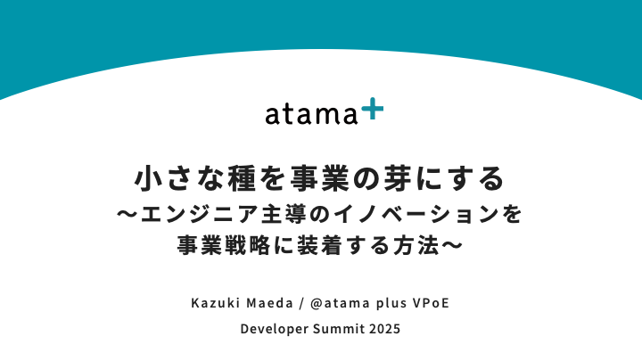

- 小さな種を事業の芽にする
- ～エンジニア主導のイノベーションを事業戦略に装着する方法～

 

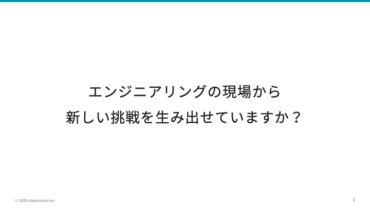

- 今日この場に来てくださっている方のモチベーションを聞いてみたいと思うのですが、
- 現場から起こすイノベーションに興味がある、もっとありていに言うと、イノベーションを起こせない状況にフラストレーションを抱えているという方が多いのではないでしょうか？
- 挙手できます？
- ありがとうございます

 
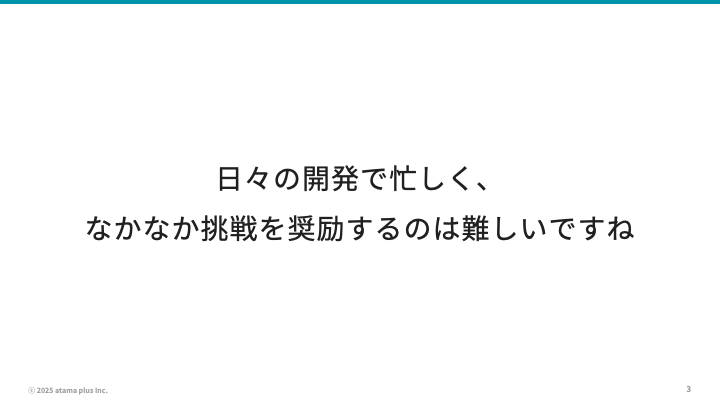

- 現場からイノベーティブな活動していきたいなって思いつつも、普段の業務だけで忙しいし、
- なかなかそれを奨励したりするのは難しいですよね

 
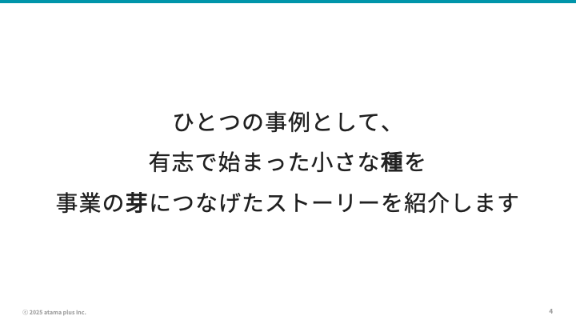

- 一つの事例として、弊社で去年取り組んでいた、現場の有志で始まった小さな種を、
- 社内を巻き込んで事業の芽に育てたストーリーを紹介できればと思います

 
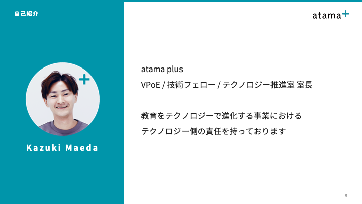

- このまま本題に入ってもいいのですが、簡単に自己紹介させてください
- 前田と申します
- atama plusというEdTechのスタートアップで、VPoE・技術フェローをしております
- 最近は、今日の話にも関連するのですが、テクノロジー推進室という組織を新設し、そこの室長も兼任しております
- 教育をテクノロジーで進化させるというミッションをもつ会社において、テクノロジー側の責任者をしております

 
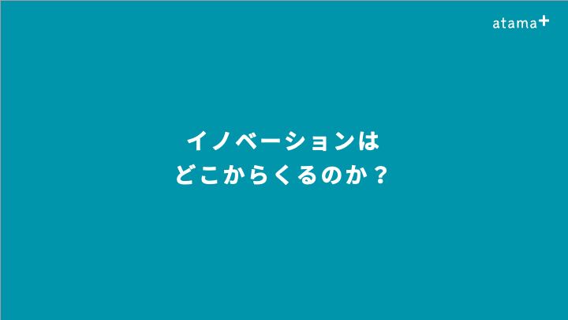

- では、今日の本題はイノベーションなのですが、言葉の抽象度が高いので、
- まずイノベーションという言葉について、今日の話の中でどう捉えているかのお話をします

 
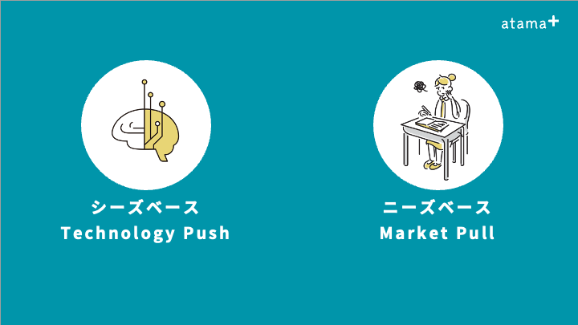

- イノベーションを起こそうとする考え方を大別したときに、
- シーズベース・ニーズベース、あるいはTechnology Push・Market Pullという言葉で伝わるでしょうか
- 聞いたことなくても、なんとなく語感でイメージできる部分もあるかと思いますが

 
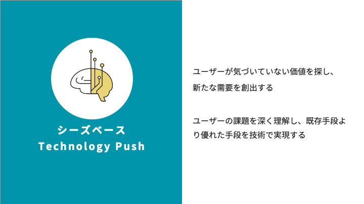

- シーズベース、あるいはTechnology Push型と言うのは、開発者の視点から起こしていくイノベーションです
- 新しい技術などを起点に、ユーザーが気づいていない価値を探し、新たな需要を創出するようなプロセスを指すことが多いアプローチです
- 一方、開発者起点とはいえ、イノベーションを受け入れてもらうには、ユーザーの課題を深く理解し、既存手段より優れた手段を技術で実現する必要があります

 
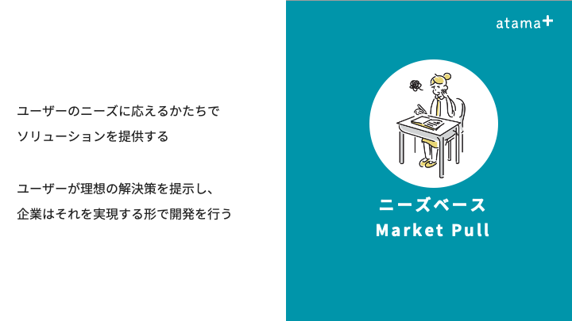

- 一方、ニーズベース、あるいはMarket Pull型というのは、ユーザーの視点から起こしていくイノベーションです
- ユーザーのニーズに応えるかたちでソリューションを提供するため、
- ユーザーが理想の解決策を提示し、企業はそれを実現する形で開発を行うというアプローチを指します

 
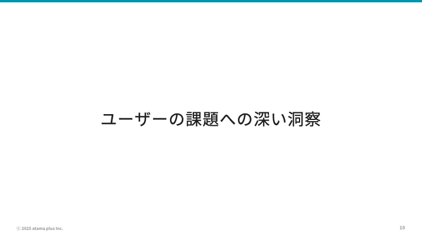

- どちらの形態においても、顕在していようが潜在的なものであろうが、ユーザーの課題に対する深い洞察が
- イノベーションを起こす上で非常に重要となります。
- 「この技術つかって何かやってみようよ」系が失敗しがちなのは、この洞察の有無に起因するんじゃないかな、と思います

 
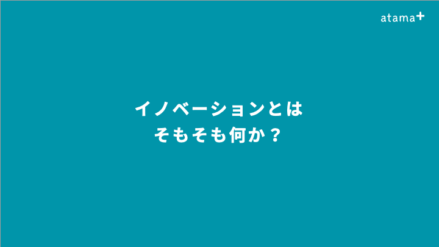

- では、イノベーションという言葉そのものについてもう少し深ぼってみましょう

 
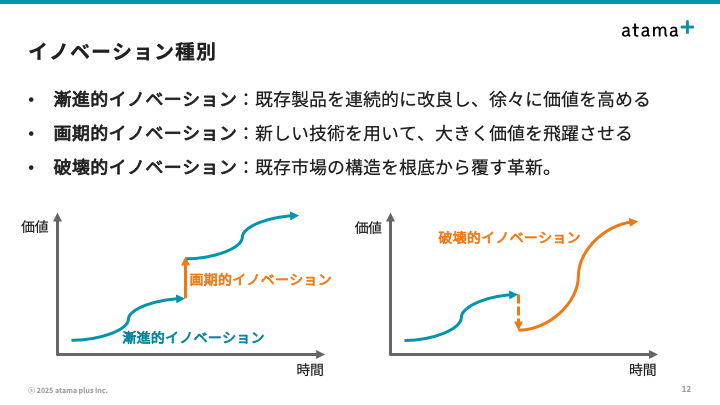

- 『日本のイノベーションのジレンマ』という本に、3種類のイノベーションについて言及されています
- 漸進的イノベーション：既存製品を連続的に改良し、徐々に価値を高める
    - ここは普段の開発で一番意識されている、達成できている部分かと思います
    - ユーザー価値を向上するための日々の「改善」や「改良」がここに当たります
- 画期的イノベーション：新しい技術を用いて、大きく価値を飛躍させる
    - 漸進的イノベーションでは達成できない非連続なジャンプアップを実現するようなものです
    - 例が難しいのですが、Macのタッチスクリーンとかのイメージです。賛否ありそうですが・・
- 破壊的イノベーション：既存市場の構造を根底から覆す革新。
    - iPhoneが既存の携帯電話市場を完全に塗り替えてしまったような例があります

 
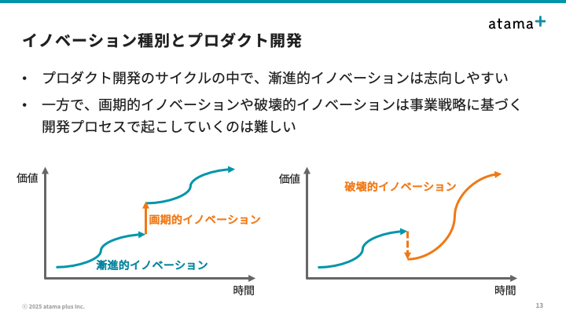

- プロダクト開発のサイクルの中で、漸進的イノベーションは志向しやすいと思います。
- どのようなユーザーの課題に対して、どのような価値を提供するか、という観点から、機能開発・改善を続けていくことが漸進的なイノベーションにつながります
- 一方で、画期的イノベーションや破壊的イノベーションは事業戦略に基づく開発プロセスで起こしていくのは難しいと考えます

 
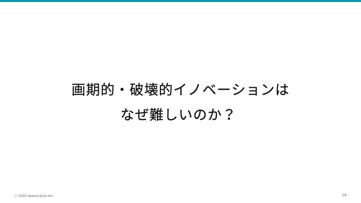

- なぜ、画期的・破壊的イノベーションは難しいのでしょうか？

 
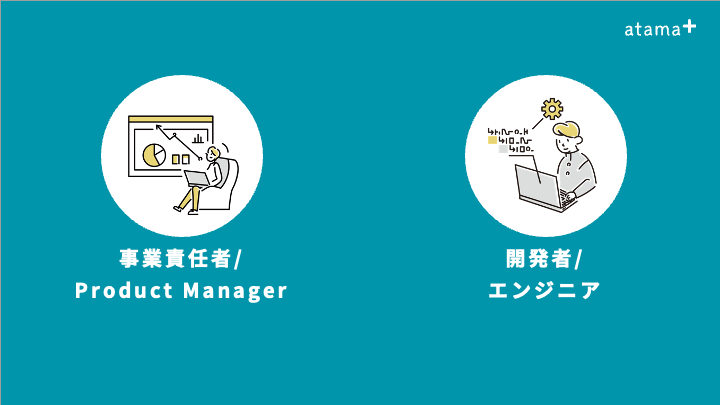

- ここでは、プロダクト開発に関わる色々な役割の人の中で、特に事業責任者の目線と、開発者の目線からイノベーションに対する考え方を覗いてみます

 
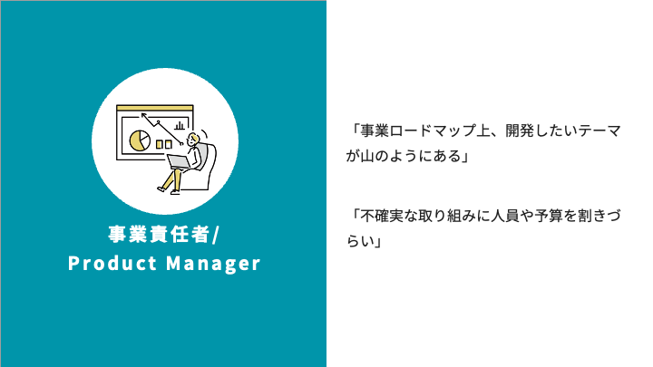

- 事業責任者側の目線から考えると、売上や利益のような経営上のKPIをはじめ、それらの要素であるユーザー数やLTVなどの数値目標を達成する責務があります
- そのために積み上げている事業ロードマップを鑑みると、目標達成のために開発したいテーマが山のようにある状況が多いかと思います
- そこにすでにリソースが手一杯、という状況において、画期的・破壊的イノベーションのような不確実な取り組みに人員や予算を割きづらいと考えてしまっても仕方ない側面があります

 
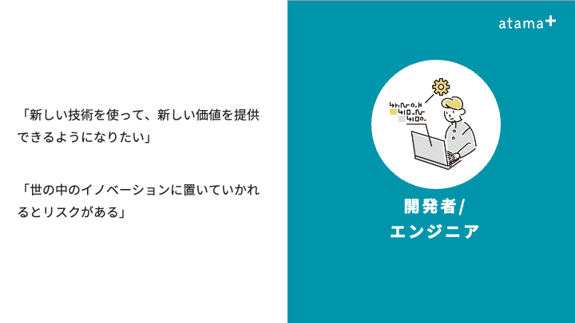

- 一方、開発者側の目線から考えるとどうでしょうか
- エンジニアとしては新しい技術を使って挑戦したいし、プロダクト感度が高いエンジニアであれば、さらにそこから新しい価値を提供できるようになりたい、というように技術をどうやって活用するかを考えることが多いかと思います
- また、昨今の生成AIのような世の中のあり方を変えるポテンシャルがあるようなイノベーションに置いていかれると、自身のスキルやキャリアにおいてもリスクがある、といった側面もあるかと思います

 
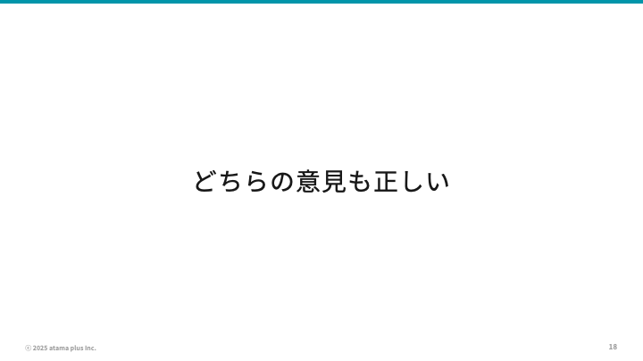

- これは見えている世界、志向しているものが違うだけで、どちらの意見も正しいと思います

 
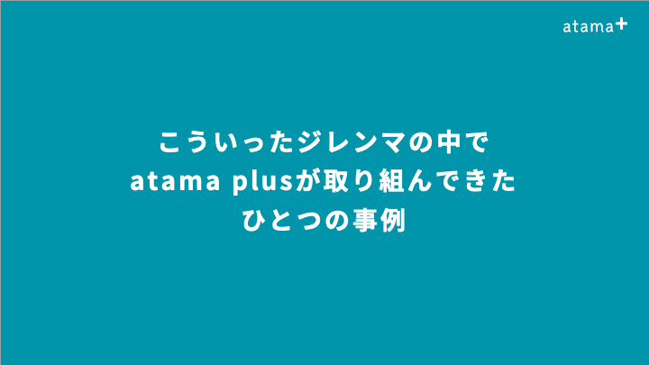

- 本日は、そういったジレンマの中で、atama plusが取り組んできたひとつの事例を紹介します

 
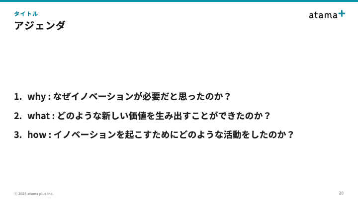

- こちらがこの後のアジェンダです
- ゴールデンサークルとは順番が違うんですが、最初に弊社の背景をお伝えしながら、なぜイノベーションが必要だと思ったのかについてお話しします
- 次に、どうやってイノベーションを起こしたのかの前に、イノベーティブな活動の結果生まれた成果、新しい価値についてご紹介します
- そして最後に、本題である、どのようなプロセスでイノベーションを起こしたのかについてお話しします

 
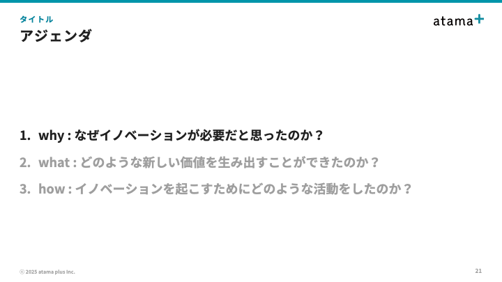

- では、まずは背景の話です

 
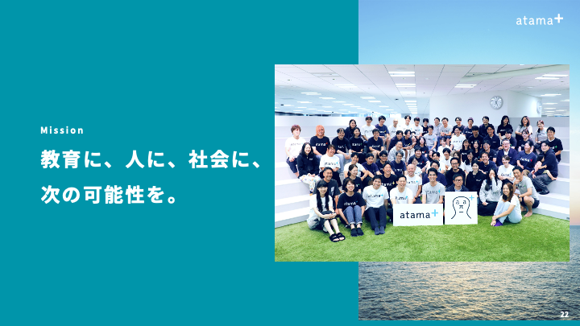

- 弊社、atama plusは、「教育に、人に、社会に、次の可能性を。」をミッションに掲げている、教育ドメインのスタートアップです

 
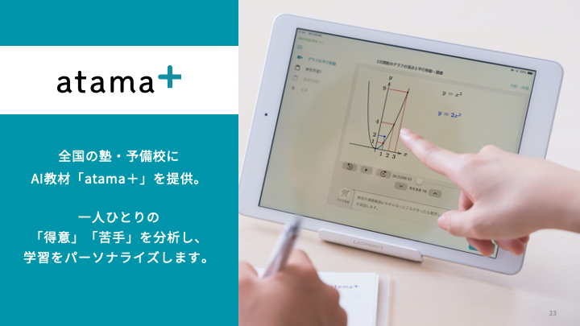

- メインのプロダクトは、AI教材「atama＋」です
- 全国の塾・予備校に提供させていただいている教材プロダクトで、
- 近年、教育ｘテクノロジーの世界でホットな、個別最適化学習の体験を提供するプロダクトです
- このプロダクト、結構すごいことやっていて、本当はその辺りも紹介したいのですが、
- 今日はあんま時間がないので、「教育業界のスタートアップなんだな〜〜」くらいに捉えてもらえれば大丈夫です

 
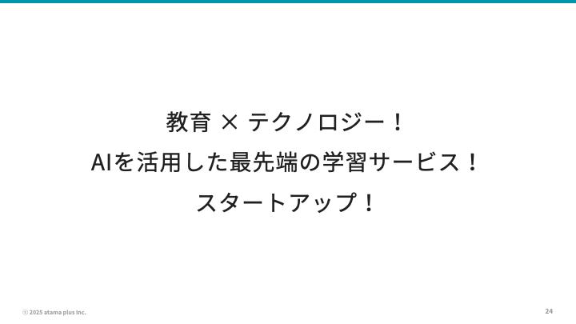

- どんな感じの会社を想像しますか？
- 教育 × テクノロジー！
- AIを活用した最先端の学習サービス！なんか面白いこと、やってそうな感じしません？
- スタートアップ！なんか新しいこと色々やってそうな感じしません？

 
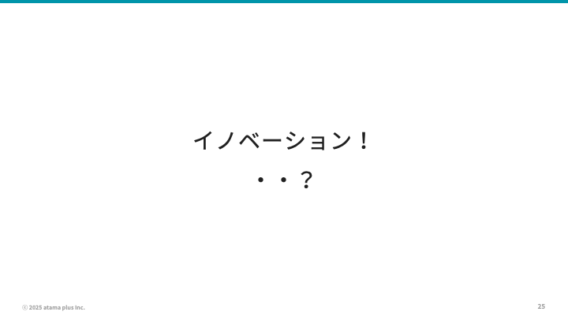

- 画期的・破壊的イノベーションがたくさん起きている環境なんだ！！
- と、手放しで言えるかというと難しくて、もうちょっと会社の状況を紹介します

 
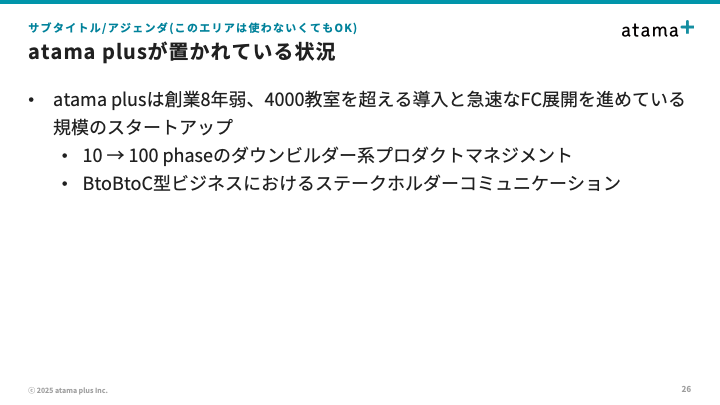

- atama plusは創業8年弱、4000教室を超える導入と急速なFC展開を進めている規模のスタートアップです
TODO: ここ補足する
- 利用いただいている規模を考えると、10 → 100 phaseのダウンビルダー系プロダクトマネジメント
- さらに、塾・予備校に提供していると言うこともあり、atama＋を塾様に導入していただいて、そこから生徒さまに利用していただくという、いわゆるBtoBtoC型ビジネスの構造となっています
- つまり我々の対向にいるのは塾や予備校様の事業体であり、CSチームを中心としたステークホルダーコミュニケーションもビジネス上非常に大事な要素となってきます

 
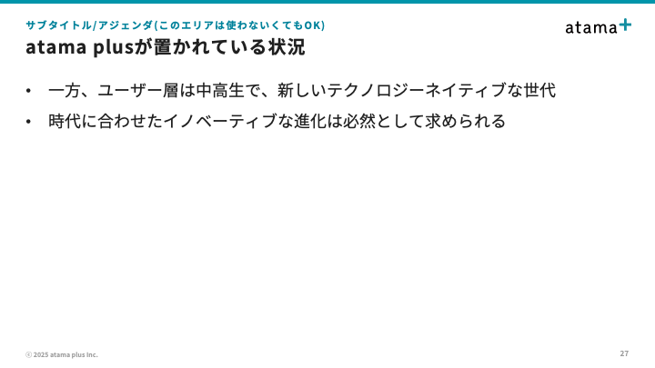

- 一方、ユーザー層は中高生なんです
- この難しさがEdTechの難しさだと思っていて、導入の上での意思決定者は事業者や保護者なのに、実際のユーザーは若い学生さんになります
- この構造がいろいろな難しさを生んでいるのですが、今日一つ取り上げるのは、ユーザーさんが新しいテクノロジーネイティブな世代であると言うことです
- 僕らの学生時代って、大体紙テキスト持ち運んで勉強して、みたいな選択肢しかなかったと思うんですが、すいません勝手にみなさんの年齢層を決めつけちゃってますが、だいたいそうだと思うんですが、
- 今の学生さんって、PC/タブレットを用いた学習はもう普通で、なんなら勉強をChatGPTに聞きながら進めるのもかなり普通にされてるんです
- ユーザーとしては、新しい技術があるものが当たり前の世代がどんどん入ってくるので、
- 時代に合わせたイノベーティブな進化は必然として求められるという状況にもあります

 
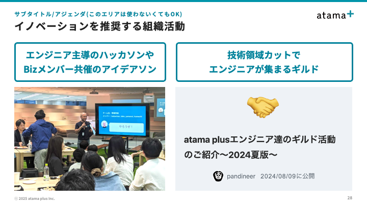

- もちろん会社・開発組織としてもイノベーションを推奨するような活動はこれまでもやってきていて、
- 例えば
- エンジニア主導のハッカソンや Biz メンバー共催のアイデアソンを開催したり
- 技術領域カットでエンジニアが集まるギルド活動というものを奨励したりはしてきています
- これ、アイデアソンの最後にCEOが講評しているところですね。「やろうぜ！」って言ってるけどこのアイデアは実現されたんですかね
- やっぱ現実的に、アイデアソンの続きで実現に向けた実際のプロダクトづくりをするのはまた何段もハードルがあって難しいんですよね

 
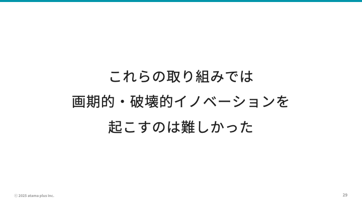

- これらの取り組みでは画期的・破壊的イノベーションを起こすのは難しかった
- というのが正直なところです

 
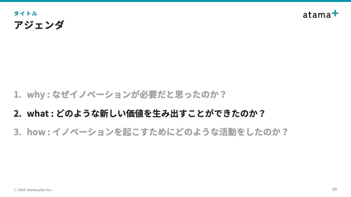

- でも何か「イノベーション」っぽいものを起こせたと思ってるからここに立ってるので、
- じゃあどんな活動をしたのかのお話しをしたいのですが、その前にまずどんなサービスを作ったのかちょっと紹介させてください
- 次の話、どんな価値を生み出せたのかです

 
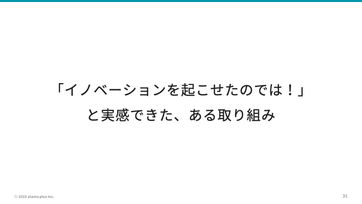

- 「イノベーションを起こせたのでは！」と実感できた、ある取り組み

 
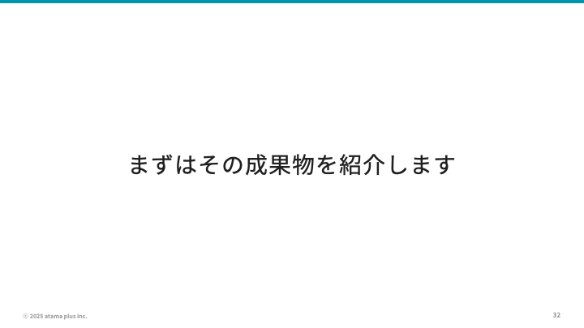

- まずはその成果物を紹介します

 
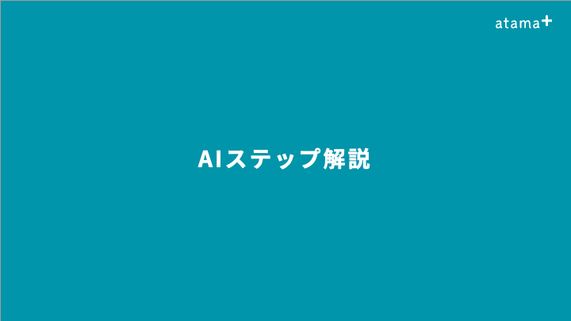

- AIステップ解説というサービスです

 
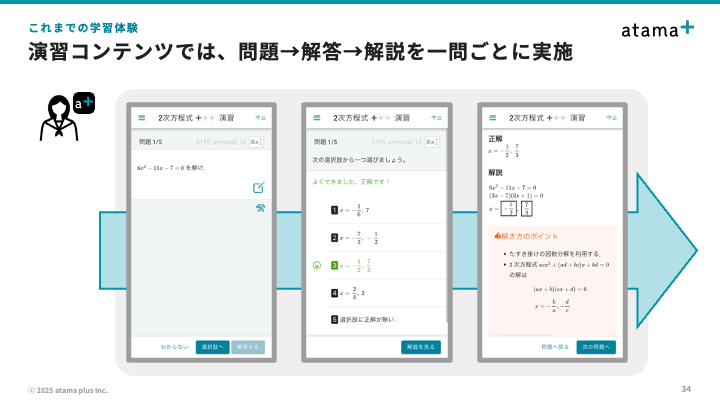

- 普通の学習体験をイメージてもらえれば思うんですが、問題を解いて、正誤判定されて、解説文を読む、という体験を
- atama plusでも提供しています

 
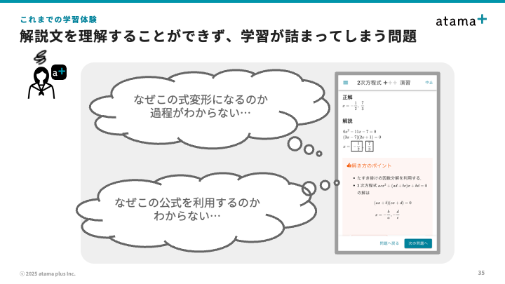

- この体験、生徒さんによっては結構難しいポイントもありまして
- 一つのペインとして、解説文を読み解くことができずに学習に詰まってしまうという問題がありました
- ちょっと頭をみなさんの中高生時代にタイムスリップして欲しいんですけど、
- 僕だと15~20年くらい戻さないといけないのでもうだいぶ記憶が怪しいんですが、
- 解説文って親切でした？
- 例えば計算系の問題だと、式変形が途中飛ばされてて、なんでこの式変形になるんだ？ってのが理解できなかったり
- 唐突にここはこの公式で〜とか言われても、なんでその公式をここで使うの？って思ったり
- 結構解説文を読むのって大変だったんじゃないかなと思います

 
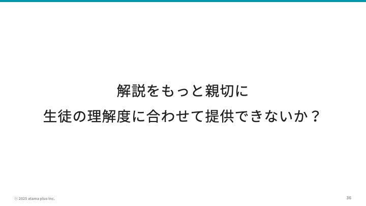

- こういったペインに対して、
- もっと生徒の理解度に合わせて、解説自体を個別最適に提供できないか？ということを考えました

 
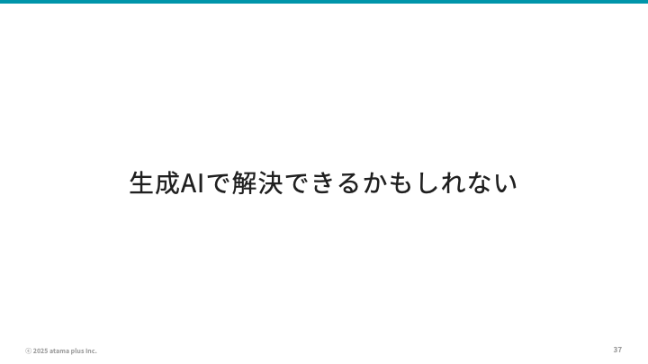

- 折しも2024年、生成AIが世の中を大きく変える期待値が高まっていた時期です
- この問題、生成AIで解決できるかもしれない、と思い生み出したのが

 

- AIステップ解説というサービスです

 
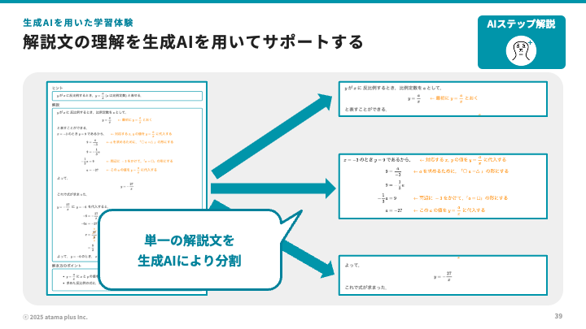

- めちゃくちゃざっくり言うと、生成AIを使って解説理解を支援します、という機能なんですが
- 教育の世界におけるAIって厳しいんですね。
- 先生が間違えることは一定許されるけど、AIが間違えることは許されないみたいな空気があるんです
- なので、わからないところを生徒がChatGPTに聞きます、みたいな体験とはまったく違うアプローチを取りました
- 我々がコンテンツとして持っている解説文、これが一塊のデータなんですが、これを意味のある単位で分割する、というタスクを生成AIにさせます

 
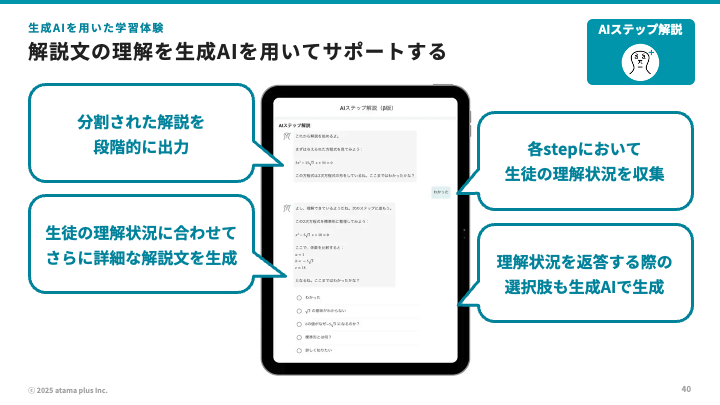

- 次に、分割した解説を、チャットのようなI/Fの画面で、段階的に出力し、解説を段階的に読んで、どこで理解が妨げられているのかに向き合うことができる体験を提供します
- 特徴的なのは、ハルシネーション対策として、生徒からの自由入力を制限し、理解できていないポイントの推測も生成AIにさせているというものがあります
- ハルシネーション対策として有効なのですが、加えて、わからないところを言語化して質問するのって、生徒さんにとっては結構ハードルで、その時点で諦めてしまう方もいるのですが、
- これは選択肢を選んでいくだけでわからないポイントを明確にして、さらに深掘りもしてくれるので気軽に利用できます

 
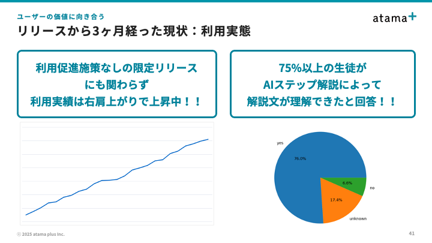

- 実際生徒さんの反応もすごくよくて
- 最初、すごく小さなグループにたいして限定公開して、特に利用促進の施策とかもしてなかったんですが、
- リリース直後からずっと右肩上がりで利用回数は増えていってまして
- さらに、毎回解説が理解できるようになったかアンケートをとっているのですが、75%以上の生徒がAIステップ解説によって解説文が理解できたと回答してくれています

 
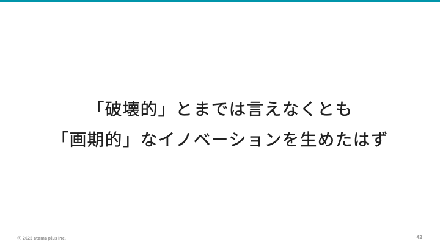

- これは、破壊的、とまでは言えないとは思いますが、画期的イノベーションくらいは認定していいんじゃないかなと思います

 
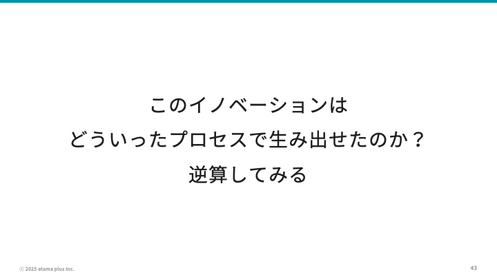

- 現実問題、イノベーション起こしていくの難しいんですって言ってたところから、こう言ったイノベーションをどうやって生み出せたのか
- 逆算してみて、そこで得た知見をお伝えできればと思います

 
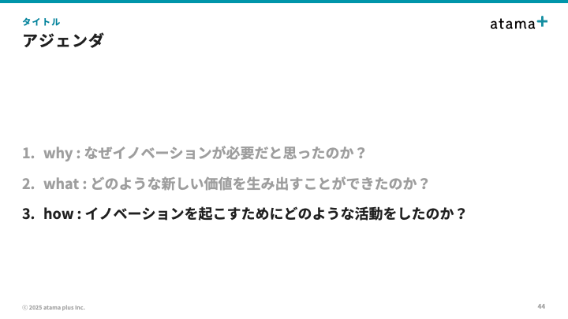

- それでは、AIステップ解説を産むためにどのような活動をしてきたのかのhowをお話しします

 
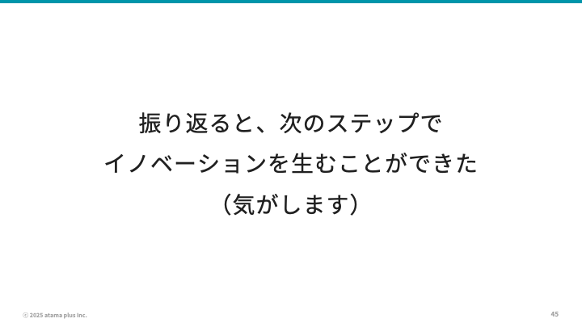

- 振り返ると、次のステップで活動することで、イノベーションを埋めたんじゃないかな、という気がします

 
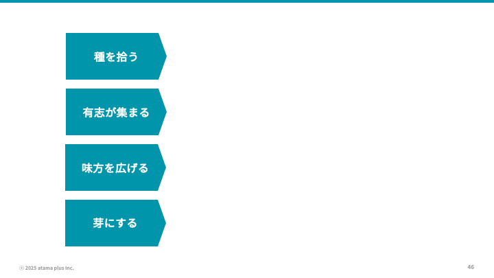

- そのステップは、
    - 種を拾う
    - 有志が集まる
    - 味方を広げる
    - 芽にする
- です
- それぞれどういうことをやってきたのか、順を追って紹介します
- ちなみに、これはEM、VPoEとしての目線で気を付けていた話で、より組織的なアプローチを試みたい場合に参考になればと思います

 
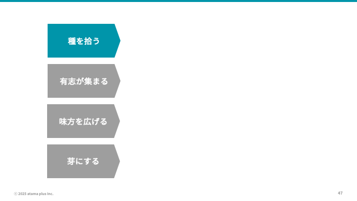

- まず、種を拾うというステップについてです

 
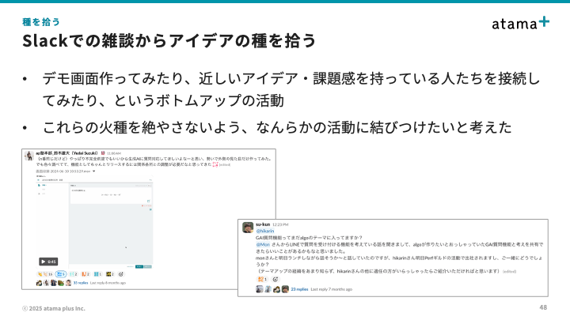

- 先に触れたアイデアソンでも種はあったのですが、他にも、Slackでの雑談からアイデアの種を拾うというものもあります
- ここに実際の発言があるのですが、
- 例えば今回の着想に近いアイデアをデモ的に実装してみたという発言が分報channelに上げられたり、
- 近しい課題感を持っている人たちを繋いでディスカッションの場をもってみたり、というボトムアップでの火種がでてくるかと思います
- 当時EMであった自分としては、こういった火種を絶やさないよう、なんらかの活動・成果に結びつけたいなと考えました

 
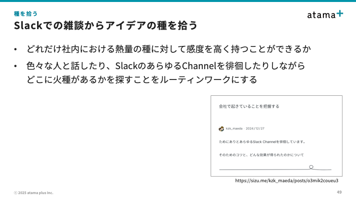

- 翻って考えると、こう言った現場からの火種・熱量の種についてどれだけ感度をもつことができるか、
- というのがイノベーティブな活動を推進したい立場の人の行動としてとても重要だと思います
- イノベーション起こして欲しいな、というだけではだめで、実際にどれだけ行動できるかに結局は帰着すると思っていて、
- 色々な人と話したり、SlackのあらゆるChannelを徘徊したりしながら、社内のどこに、どんな火種があるのかをルーティンワークにする
- それによってこそ、熱量の種を拾い上げて、育てていく下地ができるんだと思っています

 
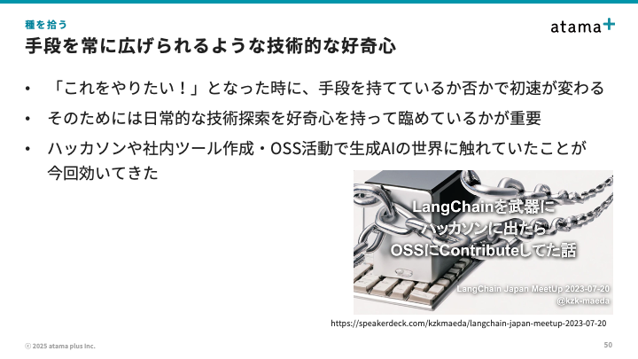

- 一方、火種を拾うだけではイノベーションに結びつけることは難しいかと思います
- 種を芽に育てていくには、肥料か水かわからないけど、育てるために技術的なアセットを持っておく必要があります
- 今回で言うと、生成AIが中心となったアイデアだったのですが、
- 生成AIの破壊的イノベーションを目にしながら、社内ツールで使ってみたり、生成AI系のOSSにコントリビューションしてみたり、
- そう言った活動をしていたおかげで、「これを実現するにはどう言った技術アセットが必要か？」についての感度を持てていました
- こう言った、日常的な技術探索を好奇心を持って臨めていることで、いざイノベーションを起こそうとなった時にとても効いてくるな、と実感しました

 
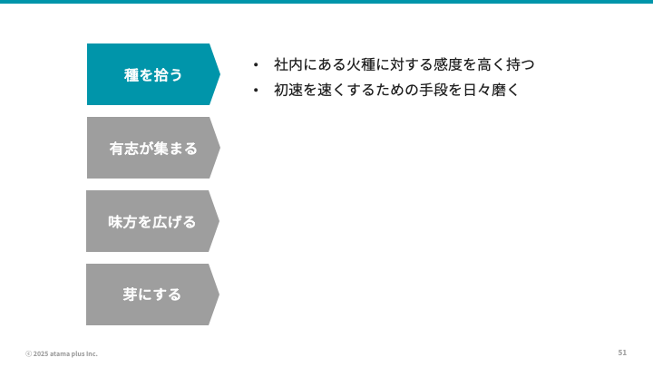

- まとめると、種を拾うというステップでは、
- 社内にある火種に対する感度を高く持つことと、
- 初速を早くするための手段、技術的な手段を日々磨くことが大事だったなと思います

 
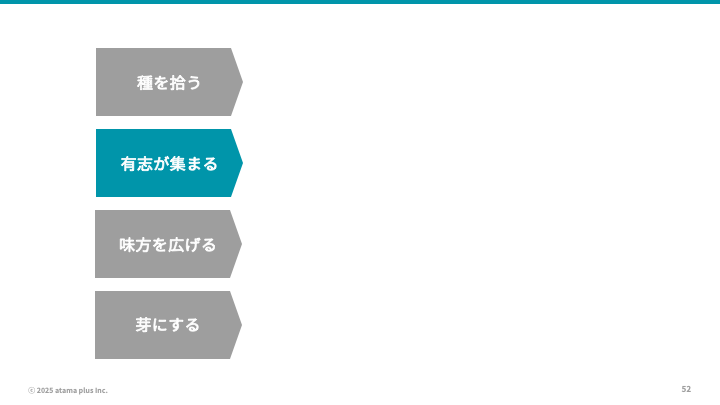

- 次に、有志が集まるというステップについてです

 
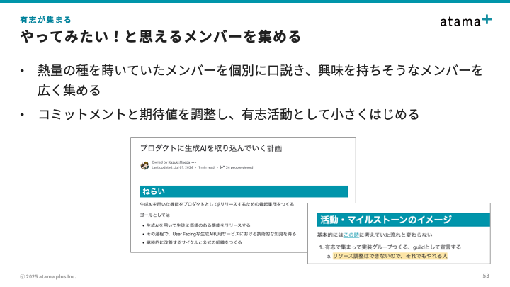

- 先ほどの種を拾うステップで紹介したような、Slackで能動的に動いていた、つまり熱量の種を蒔いていたメンバーを個別に口説きました
- せっかくだから、デモ作るだけじゃなくて、実際にプロダクトに実装してみない？と言う話とか
- その際に、正直に、実になるかはわからないし、そのための業務リソース調整もできないかもしれないけど、それでもやってみない？という話をしました
- そこで、中心的なメンバーを口説いて、その後、せっかくの機会だから一緒にやってみたいと思えるメンバーを広く募集してみました
- その際にも、実になるかわからないことやリソース調整も確約できないこと、コミットメントと期待値を調整して、
- 集まったメンバーで有志活動として小さく始めてみました

 
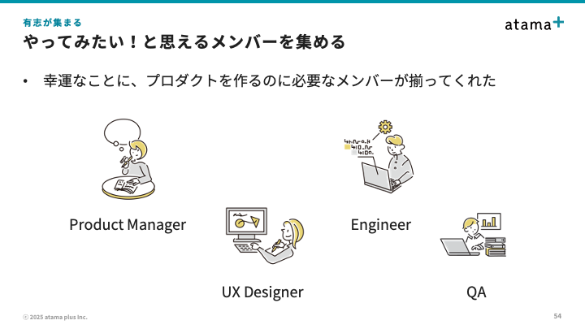

- すると、これは完全に幸運だったのですが、結果的にPdM、UX、Engineer、QA、と、プロダクトを作るのに必要な役割のメンバーが揃ってくれました

 
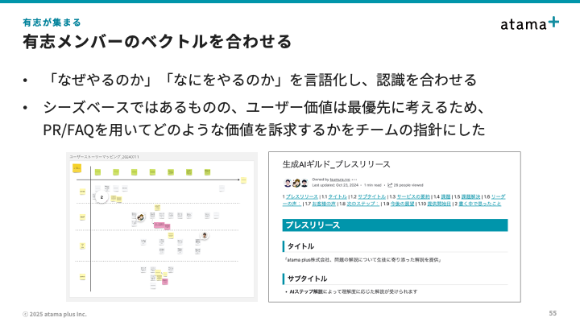

- 人が集まってチームになると、チームビルディングが重要になってきます
- しかも今回は成功確度のわからない有志活動なので、いつも以上に「なぜやるのか」「なにをやるのか」について丁寧に言語化して、認識を合わせる時間を作りました
- その過程で、シーズベースではあるものの、ユーザー価値は最優先に考える必要があるよねということをみんなで話して、
- そのプラクティスとして、Amazonでよく利用されているPR/FAQを用いて、どのような価値を訴求するのかをみんなで話し合い、言語化し、
- その後のチーム活動の指針としました

 
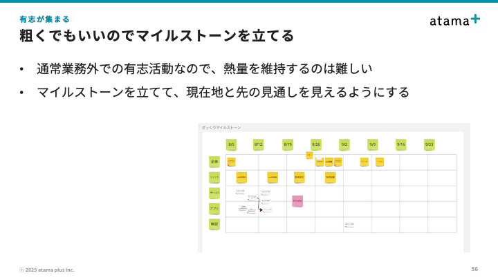

- 有志活動の難しさは、時間の使い方にもあります
- 通常の業務をみんなフルで持っていて、その外で活動することになるので、チームの熱量を維持するのは難しくなると思います
- 目的を達成するためにどんなステップで何を進めていけば良いのか、粗くてもいいのでマイルストーンを立てて、
- 現在どこにいるのか、このあと何をしないといけないのか、もっと大事なのは、いつ頃日の目を見ることができるのか、について
- それらの先の見通しを立てることも気をつけました

 
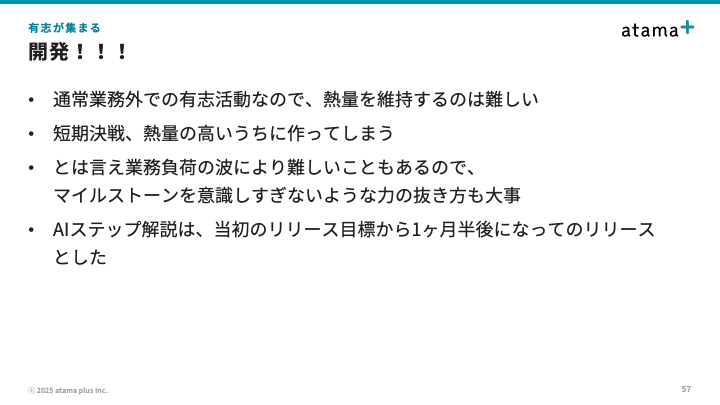

- さて、PR/FAQ揃えたり、マイルストーン立てたりしているだけでは、価値を世の中に出していくことはできず、イノベーションは生まれません
- 一番大事になる、開発のステップです
- 繰り返しになるのですが、有志活動なので、熱量を維持するのは難しいかと思います
- 今回は、短期決戦で、1ヶ月目安で、熱量の高いうちに作ってしまおう、くらいの目標を立てました
- とはいえ、みんなそれぞれ別のチームで通常業務を持っているので、その業務負荷の波によってマイルストーンを達成することが難しいこともあります
- その場合、マイルストーンやスコープを柔軟に変え、意識しすぎないよう、適度に力を抜くことも、サスティナブルな活動においては非常に重要です
- AIステップ解説は、当初のリリース目標から、結果的には1ヶ月半遅れてのリリースとなりましたが、
- 途中でチームが折れないよう、適度に力を抜きつつも短期決戦を志向しました

 
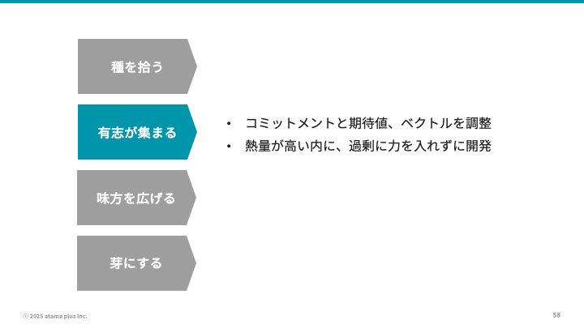

- 有志が集まるというphaseでは、
- 有志のチームを作り、コミットメントと期待値、ベクトルを調整することに時間を使うのが大事だった、ということと
- 開発においては、熱量が高いうちに、とは言いつつも過剰に力を入れすぎずに開発することが大事だったなと思います

 
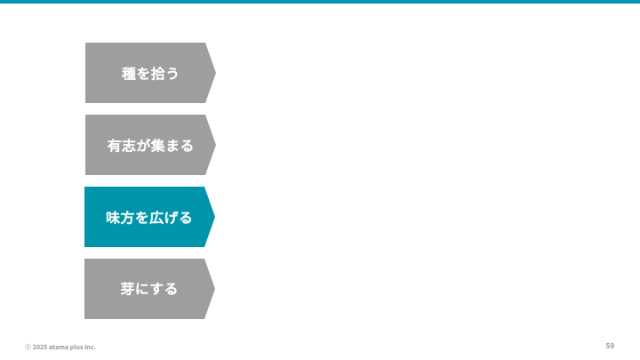

- 続いて、味方を広げるというステップについてです
- 味方が指しているのは、社内、ユーザー、そして経営です

 
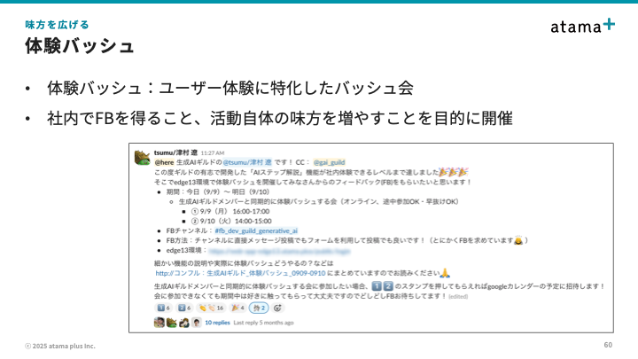

- 社内の味方を広げるために行ったのが、体験バッシュという取り組みです
- バグバッシュは聞いたことある人いますか？？
- バグバッシュというのは、従業員でプロダクトを触ってみてバグを見つけよう、みたいな取り組みですが、
- それをユーザー体験に特化して行うのが、体験バッシュという取り組みです
- 開発中のAIステップ解説を、有志メンバー外の社内の人たちに触ってもらうことで、FBを得ることももちろんですが、
- それ以上に、こう言った有志活動そのものに対して、社内で味方を増やす目的もありました
- こんな形で、社内のSlackで広く呼びかけて参加者を募りました

 
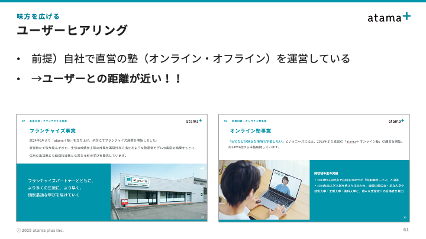

- 次は実際にユーザーに触ってもらう機会を作りました
- ちょっとその前の前提になるのですが、弊社は教育コンテンツを提供している会社ではあるのですが、
- 合わせて自社でも直営の塾をオンライン・オフラインともに運営しております
- これはプロダクト開発においても非常にメリットがあって、実際に学習する生徒さんとの距離が圧倒的に近いという特徴があります

 
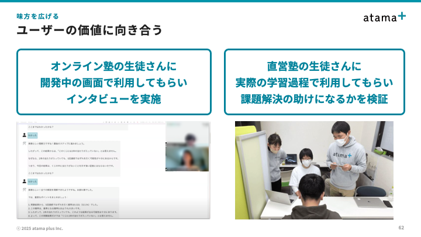

- そういった機会をフル活用して、実際に機能を生徒さんにも触ってみてもらいました
- まずは、オンライン塾で提供しているオンライン自習室にて学習している生徒さんに対して、開発中の画面を用いて機能を体験してもらい、
- その使用感についてインタビューを実施したり、
- また、直営塾に直接行って、対面でヒアリングしたりを通して、
- 実際の学習過程においてAIステップ解説が課題解決の助けになるかを検証しました
- 検証の中でも好意的な反応が多く得られ、手応えを感じていました

 
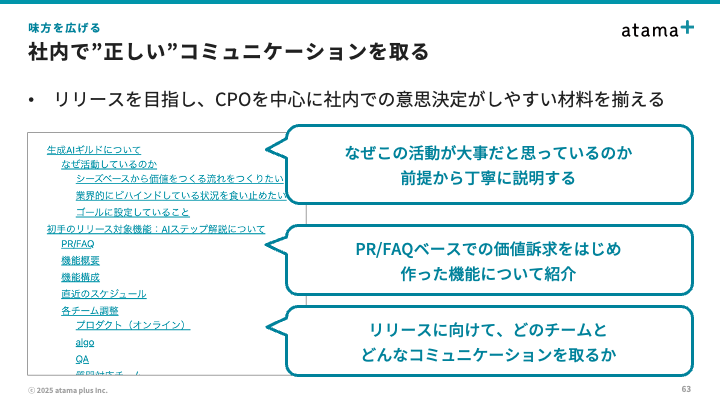

- ここまでの活動は、いわば非公式でのものなので、これを会社として正式に提供するには、正しいコミュニケーションを取る必要があります
- しかし、いきなり有志での活動をいきなり経営に打診しても寝耳に水になるので、有志活動を行いながら、都度CPOとのコミュニケーションを欠かさずに進めていました
- また、そもそもSlackなどでオープンに活動していたので、盛り上がりを検知してもらいやすい状況ではありました
- そして、体験バッシュやユーザーヒアリングを経て、実際にリリースを目指そうとした時に、改めて経営として意思決定しやすい材料を整備しました
- 具体的には
    - どうしてこういった有志活動を行っているのか、なぜそれが大事だと思っているのかを前提から説明すること
    - PR/FAQを用いて、どのようなユーザーへの価値訴求を狙っているのか、そのためにどんな機能を作ったのか
    - そして、リリースに向けて、どのチームとどんなコミュニケーションをとっていくつもりか
- などを一枚にまとめて打診しました

 
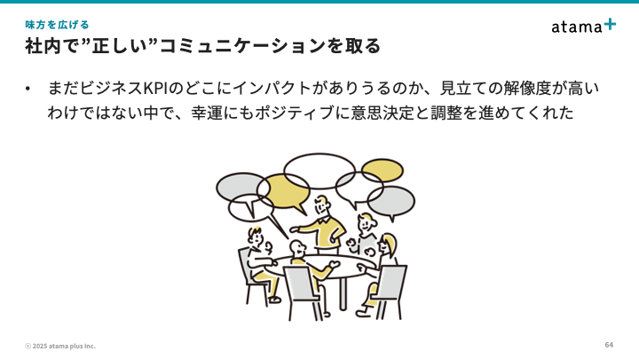

- 正直、この段階では、ビジネスKPIに何にどんなインパクトがあるのか、まだ見立ての解像度は低い状態でした
- にもかかわらず、こう言ったボトムアップでのイノベーティブな活動をポジティブに捉えてもらい、意思決定と調整を進めてくれました
- 経営の懐にもよるところがあるし、ここまでのステップを丁寧に踏んできた効果もあると思っています

 
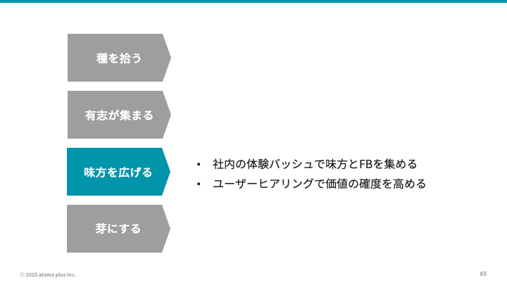

- 味方を広げるというステップでは、
- 体験バッシュ、ユーザーヒアリングを通じて、社内外の味方を広げることと、
- それを持って、経営を巻き込んで、正しい意思決定のためのコミュニケーションを取ることが大事だったなと思います

 
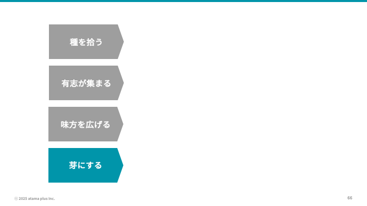

- 最後に、芽にするというステップについてです

 
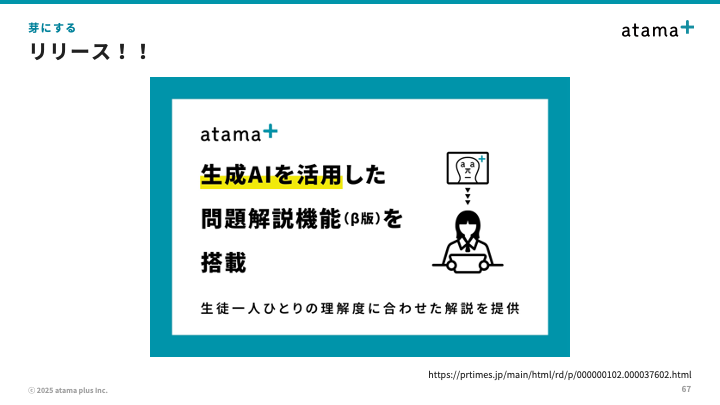

- ここまでの活動が実を結び、ついにAIステップ解説はリリースすることができました

 
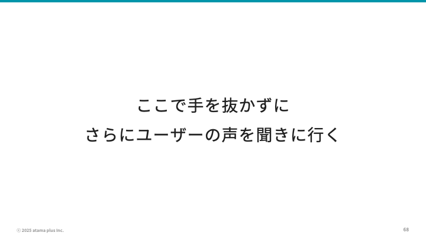

- これで、限定公開ではあるものの、実際の生徒さんが学習過程で使える状態になったので、
- 手を抜かずに、さらにユーザーの声を聞きにいくことに力を入れました

 
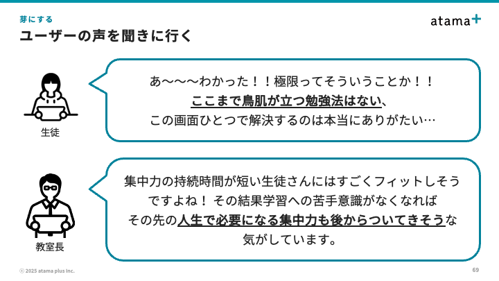

- リリース後しばらく経って、実際に学習の中で利用してくれている生徒さんにヒアリングにいくと、
- ここまで鳥肌が立つ勉強法はない！という反応を返してくれた生徒さんがいたり、
- また、塾の教室長の方からも非常に嬉しい声をいただき、チームとしても感無量でした

 
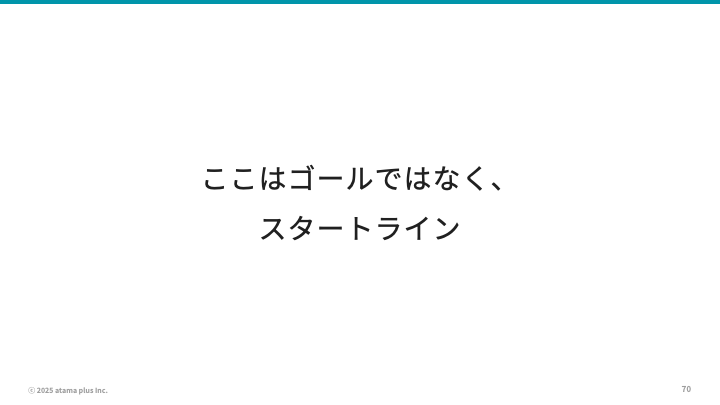

- ですが、ここはゴールではなく、スタートラインです

 
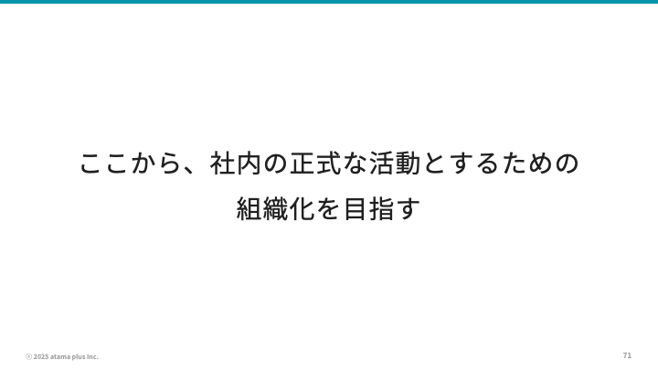

- ここまでできても、まだ非公式組織での有志活動です
- ここから、社内で正式な活動とするためには、持続性を持たせるためにも組織化を目指す必要があります

 
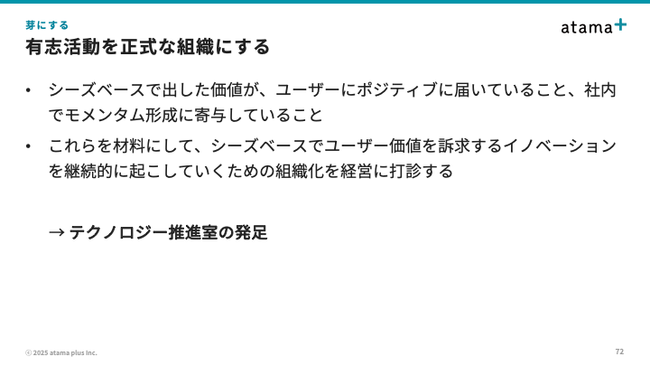

- ここまでチームで活動した結果、シーズベースで出した価値がユーザーにポジティブに届いていること、
- また、その活動自体が社内でのモメンタム形成に寄与していること
- これらが明確な状況だったので、それを材料にして、シーズベースでユーザー価値を訴求するイノベーションを
- 継続的に起こしていくため、それをミッションにする組織化を経営に打診しました

- その結果、「テクノロジー推進室」を発足させることができました

 
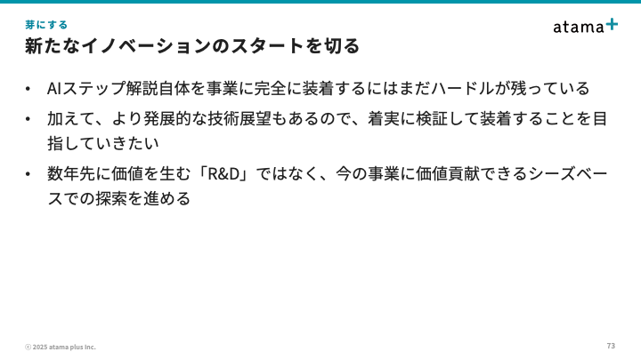

- ここまで有志で作り上げてきたAIステップ解説も、事業装着するにはまだハードルが残っています
- 加えて、さらに発展的な技術展望もあり、それを着実に検証して事業に装着することを目指していきます
- 我々はスタートアップで、リソースは少なく、時間もありません
- 数年先に価値を生む「R&D」ではなく、今の事業に価値貢献できるシーズベースの価値探索を進めていきます

 
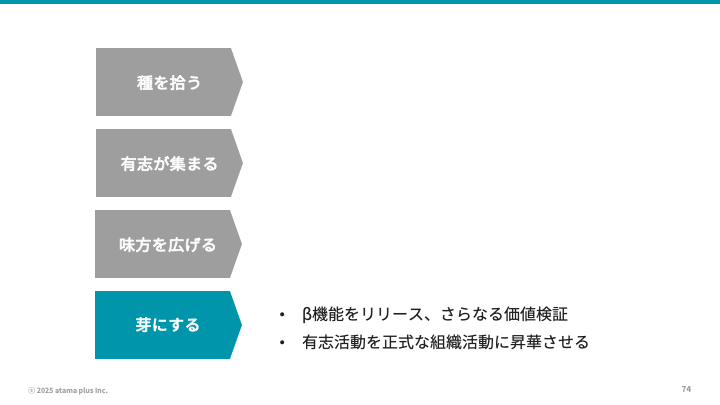

- 芽にするというステップでは、
- リリースを目指して、ユーザーの声を聞きにいくことと、
- そして、有志活動を正式な組織活動に昇華すること
- を行っていました

 

- ステップ全体を改めて俯瞰してみると、このような取り組みをしてきております

 
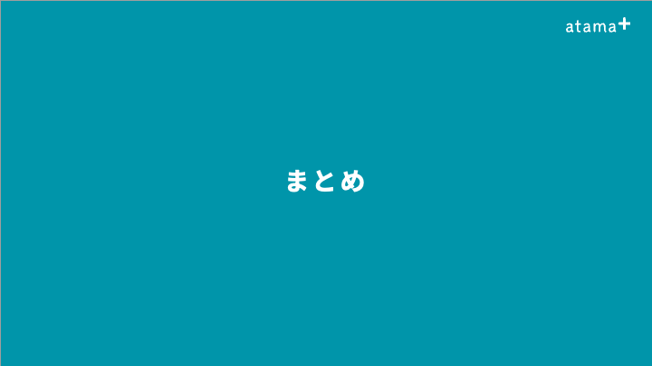

- 最後に、ここまでの話を総括して終わりたいと思います

 

- 今日のお話は
- 「小さな種を事業の芽にする」と題して、
- エンジニア主導のイノベーションを、事業戦略に装着する方法、というお話をさせていただきました

 

- イノベーションには、シーズベースとニーズベースの考え方があり、
- どちらを志向するにおいても、ユーザー課題への深い洞察が必要であるということ

 

- シーズベースに多くみられる、画期的・破壊的イノベーションを起こしていくには、
- その不確実な取り組みに対して、立場によって見え方が異なり、難しさがあるという話が前提にありました

 
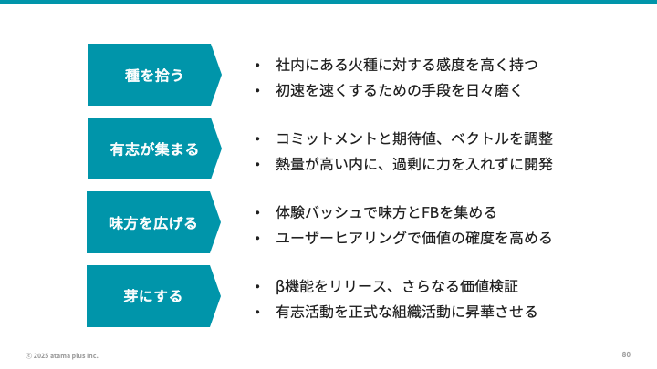

- そこで、その壁を突破する一例として、atama plusがAIステップ解説を生み出した際に行った取り組みについて、ご紹介しました
- その取り組みは、種を拾う、有志があつまる、味方を広げる、芽にする、というステップを踏んで、
- 小さな火種を拾うところから始まり、有志のチームで熱量を育てながら、社内外の味方を増やし、組織化してイノベーションの芽にする、というものでした

 
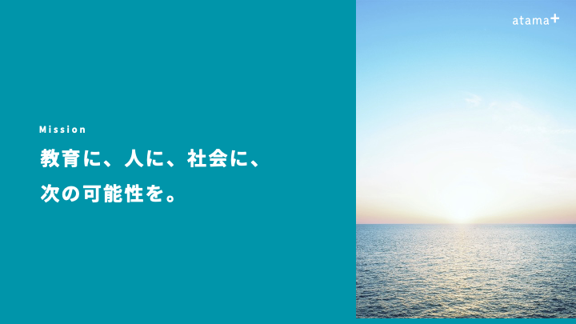

- 教育をテクノロジーで進化させるという目標に対しては、まだまだできることがたくさんあります
- 我々は、ミッション実現のために、引き続きイノベーションを志向していきたいと思います

 
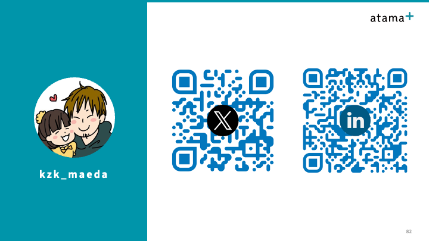

- ご清聴いただきありがとうございました
- 話し足りなかったこといっぱいあるので、よかったらこの辺で繋がってもらったり、この後お話しする機会をいただけたら嬉しいなと思います
- 以上です、ありがとうございました。
