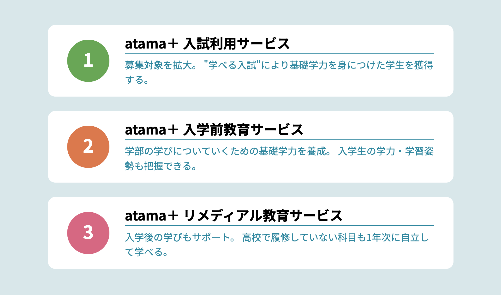
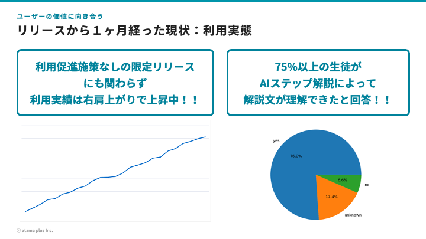

<!-- _class: title -->

# 日本の教育の未来を考える
## テクノロジーは教育をどのように変えるのか

---

# 自己紹介

- 前田 和樹（kzk_maeda）
- atama plus株式会社 VPoE / 技術統括
  - データや機械学習、生成AIに関する開発
- AWS Community Builder
---

<!-- _class: agenda -->
# アジェンダ

* 日本の教育史概観
* EdTechの隆興とトレンド
* atama plusが目指す新しい学習
* 生成AI時代の教育と挑戦
* まとめ

---
<!-- _class: agenda -->
# アジェンダ

* 日本の教育史概観
* EdTechの隆興とトレンド
* atama plusが目指す新しい学習
* 生成AI時代の教育と挑戦
* まとめ

---

## EdTechとは

* Education x Technology
* 教育現場が直面している課題を、テクノロジーで解決することを志向

---
<!-- _class: teal-bg -->

## 教育現場が直面している課題とは？

教育史から現代の教育現場の課題を紐解く

---

# 日本の教育：150年の歩みと構造

*   **礎石 (1872~)：** 明治期の「学制」公布。近代国家建設のため、全国一律・中央集権的なシステムを構築。国民皆学を目指す。
*   **発展と変遷：** 戦後改革（6・3・3制）、学習指導要領改訂（ゆとり教育とその見直し等）など、部分的な改定機会はありつつも、根幹は変化していない
*   **構造的な特徴：**
    *   中央集権的な管理体制（文部科学省）
    *   全国ほぼ一律のカリキュラム
    *   学年・学級制、年齢主義
    *   大学入試を頂点とする選抜システム

---

# 変化を阻害する三角関係構造

教育方法の抜本的な変革に対する抵抗力を生み出してきた要因

*   **文化的要因：** 集団主義、同調性、権威尊重。受験偏重の価値観。
*   **制度硬直性：** 中央集権的な行政（文科省）。学習指導要領、教科書検定による強い統制
*   **社会的期待：** 学歴重視の社会構造。保護者や企業の期待が現状維持を後押し。

<!-- この強固な連携構造（鉄の三角形）が、教育方法の抜本的な変革に対する抵抗力を生み出してきた側面がある。 -->

---

# 変化の兆し

*   **GIGAスクール構想 (2019~)：** 1人1台端末とネットワーク環境の整備
*   **Society 5.0時代の要請：** AI時代に対応できる人材育成の必要性
*   **学習指導要領の改訂：** 「主体的・対話的で深い学び」の重視

Source: <a href="https://www.mext.go.jp/a_menu/shotou/new-cs/1383986.htm">文部科学省 学習指導要領改定</a>

---
<!-- _class: agenda -->
# アジェンダ

* 日本の教育史概観
* EdTechの隆興とトレンド
* atama plusが目指す新しい学習
* 生成AI時代の教育と挑戦
* まとめ

---

## EdTechとは

* Education x Technology
* 教育現場が直面している課題を、テクノロジーで解決することを志向

---
<!-- _class: teal-bg -->

## テクノロジーをどのように活用できるか？

---

## トレンド①：AIが「一人ひとり」の学びを変える

*   **AIによる個別最適化学習（アダプティブラーニング）：**
    *   生徒一人ひとりの理解度、苦手、ペースに合わせて、AIが最適な問題や教材を提供
    *   「みんな同じ」から「自分だけの学び」へ。
*   **AIチューター/自動フィードバック：**
    *   AIが質問に答えたり、間違いを分析してアドバイス
    *   先生の負担軽減にも

---

## トレンド②：学びの「場」と「機会」が広がる

*   **オンライン学習プラットフォーム：**
    *   時間や場所を選ばずに学べる。有名講師の授業もアクセス可能に。
    *   学習塾や予備校での活用も拡大。大学でも導入が進む。
*   **デジタル教材/LMS（学習管理システム）：**
    *   多様な教材へのアクセス。学習進捗の可視化。
*   **生涯学習・リスキリング：**
    *   社会の変化に対応するため、社会人も学び続ける時代へ。

---

## トレンド③：「体験」が学びを深める

*   **VR/AR（仮想現実/拡張現実）：**
    *   リアルな体験が難しいことを仮想空間でシミュレーション。
        *   （例：歴史的建造物の探訪、危険な科学実験、人体内部の観察）
    *   学習内容への興味・関心、理解度を高める。
*   **ゲーミフィケーション：**
    *   ゲーム要素を取り入れ、楽しく学習意欲を維持。

---

## トレンド④：テスト手法が「評価」を変える

*   **CBT（Computer-Based Testing）：**
    *   コンピューター上で実施する試験。即時採点・結果フィードバックが可能
    *   一部資格試験やや英語外部検定試験での導入事例
*   **IRT（Item Response Theory）：**
    *   受験者の能力値や問題の難易度を数値化する理論
    *   より精密な学力測定と公平な評価が可能に
*   **CAT（Computer Adaptive Testing）：**
    *   受験者の回答に応じて次の問題を適応的に選択

---

## トレンド⑤：データが学びを「未来」に繋ぐ

*   **eポートフォリオ：**
    *   学びの成果（作品、資格、活動記録など）をデジタルで記録・蓄積
    *   大学入試や就職活動での活用も目指されたが、2020年に事業運用停止
*   **xAPI:**
    *   学習経験データを保持するための標準規格

---
<!-- _class: teal-bg -->
## 具体的にどのような革新がされているのか
とあるEdTech企業の挑戦について紹介します

---
<!-- _class: agenda -->
# アジェンダ

* 日本の教育史概観
* EdTechの隆興とトレンド
* atama plusが目指す新しい学習
* 生成AI時代の教育と挑戦
* まとめ

---
<!-- _class: teal-bg -->

## 新しい学習①：一人ひとりに合わせたカリキュラム

---

---

---

---

---

---

---

---
<!-- _class: teal-bg -->

## 新しい学習②：三角関係構造への挑戦

---

# 【再掲】変化を阻害する三角関係構造

教育方法の抜本的な変革に対する抵抗力を生み出してきた要因

*   **文化的要因：** 集団主義、同調性、権威尊重。受験偏重の価値観。
*   **制度硬直性：** 中央集権的な行政（文科省）。学習指導要領、教科書検定による強い統制
*   **社会的期待：** 学歴重視の社会構造。保護者や企業の期待が現状維持を後押し。

<!-- この強固な連携構造（鉄の三角形）が、教育方法の抜本的な変革に対する抵抗力を生み出してきた側面がある。 -->

---

---

---

---

<!-- _class: teal-bg -->
### atama plusとして、
### これまで数々の教育への挑戦をおこなってきた

---
<!-- _class: teal-bg -->
### 一方、2022年以降の生成AI/LLMの破壊的イノベーションは
### 世界のあり方を大きく変え得る

---
<!-- _class: agenda -->
# アジェンダ

* 日本の教育史概観
* EdTechの隆興とトレンド
* atama plusが目指す新しい学習
* 生成AI時代の教育と挑戦
* まとめ

---
<!-- _class: teal-bg -->
## AIの時代

---

Source: <a href="https://ai-2027.com/">AI 2027</a>

---

# AI/LLMが変える世界

* これまでの技術革新を凌駕し、世界を変えるスピードでAI/LLMは進化し、社会に適合してきている
* AI/LLMは人間の知性を拡張し、技術との相互作用をより自然で直感的なものに変える可能性を持つ

---

# AI/LLMが変える教育

* 教育の世界にもAI/LLMの活用は高速に広まってきている
    * 学習コンテンツの生成
    * 即時フィードバック
    * 対話形式での質問回答

---

# AI/LLMが変える教育
## 学習コンテンツの生成
* Duolingoは、生成AIの活用により、148の新しいコースを1年未満で開発・リリース
* 従来では何年もかかっていた業務

Source: <a href="https://www.theverge.com/news/658968/duolingo-language-courses-ai">theverge.com</a>

---

# AI/LLMが変える教育
## 即時フィードバック
* メイツによる英文添削AIフィードバックサービス
* 生徒が入力した英作文に対して、生成AIが即座にフィードバック

Source: <a href="https://mates-edu.co.jp/news/7769">株式会社メイツ</a>

---

# AI/LLMが変える教育
## 対話形式での質問回答
* 生徒の問いに対して、AIが学習サポート
* 問題の解答を教えるものから、ヒントを提示するもの、類題を生成するものまで活用方法は様々

Source: <a href="https://studypocket.ai/student">スタディポケット</a>

---
<!-- _class: teal-bg -->

## 生成AIを用いた新しい学習体験の提供は志向しやすい時代

---
<!-- _class: teal-bg -->

## atama plusとしてどのような価値にフォーカスするか

---

## 現在の学習体験での負に着目する

---

---

---

---

---
<!-- _class: teal-bg -->

## この課題を解決できないか？

---

---

---

---

---
<!-- _class: teal-bg -->
## ユーザーと価値に向き合う

---

---

---

---

# 生成AI時代の教育と挑戦

* 生成AIによってこれまでにない学習体験を提供できるようになった
* 一方、これまで提供できていた学習体験が根底から覆される可能性も
* EdTech企業として、教育にどんな価値を提供していくか？という挑戦

---
<!-- _class: agenda -->
# アジェンダ

* 日本の教育史概観
* EdTechの隆興とトレンド
* atama plusが目指す新しい学習
* 生成AI時代の教育と挑戦
* まとめ

---

# まとめ

* **日本の教育は歴史的転換点に：** 150年続いた構造からの脱却が始まりつつある
* **EdTechの可能性：**
  * 個別最適化による一人ひとりに合った学び
  * 学びの機会拡大と場所・時間の制約からの解放
  * データ活用による効果的な教育と将来への接続

---

# まとめ

* **生成AIが教育にもたらす変革：**
  * 従来の「教え方」「学び方」の根本的な変化
  * 新しい学習体験の創出と価値提供の再定義
* **atama plusの挑戦：**
  * 個別最適学習と、膠着構造への挑戦
  * テクノロジーを活用しつつも、ユーザー価値を大切に
  * 「何を学ぶか」だけでなく「どう学ぶか」の変革

---

## 宣伝

---

---

## ぜひご参加ください！

https://aws-startup-community.connpass.com/event/354497/

---

<!-- _class: title -->

# ご清聴ありがとうございました

## 質問・ディスカッションをお待ちしています

