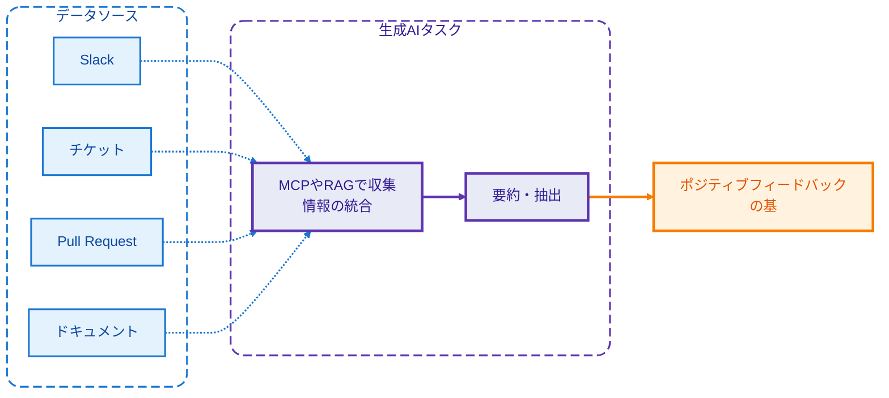
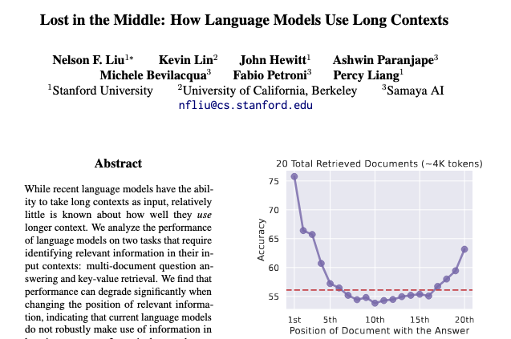
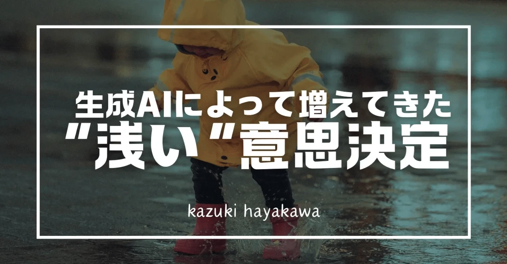
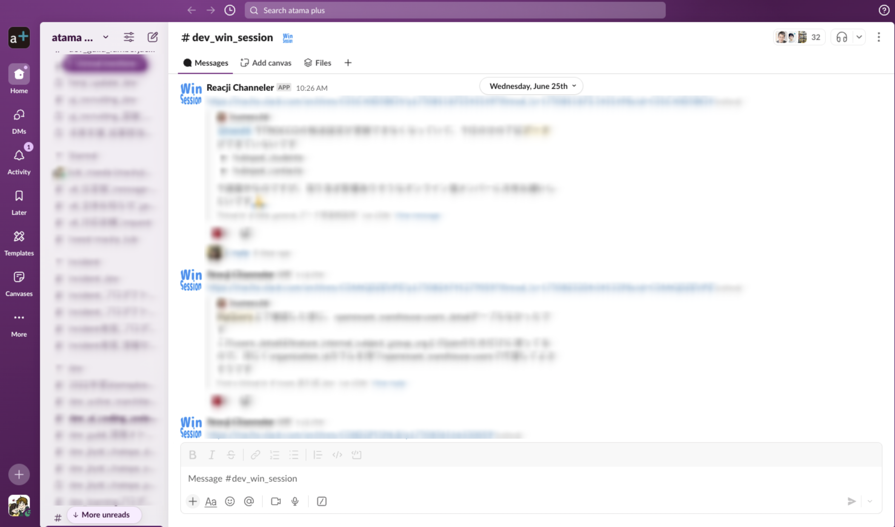

# 敢えて生成AIを使わない
# マネジメント業務
### もあるよ

 

EMゆるミートアップ vol.10  

kzk-maeda

2025.07.07

---
layout: image-left
image: ./images/profile.png
class: flex flex-col justify-center
---

# 自己紹介

### Kazuki Maeda

atama plus株式会社  
VPoE / 技術統括

- 組織マネジメント・技術マネジメントを管掌
- 生成AI好きです。逆張りではありません。

---
transition: fade-out
class: flex flex-col
---

# 業務の中で生成AIを使わない日はない

| 分野 | 活用例 |
| --- | --- |
| **プロダクト開発** | Claude Codeで新プロダクトのプロト作成 コード生成・レビュー支援 |
| **情報管理・分析** | MCPでドキュメント検索・作成 データ分析の自動化 |
| **組織コミュニケーション** | 組織全体会のサマリ作成 1on1の内容整理・振り返り |
| **他組織との連携** | 人事・コーポレートとの議論前の壁打ち 専門性が異なるチームとの議論準備 |

---
layout: center
class: text-center
---

# でも、ある業務では 生成AIを使わないことにしている

---
layout: center
class: text-center
---

# 振り返り面談のための情報収集

---
layout: center
---

# 一見、生成AIに向いていそうなタスク

---
layout: center
class: text-center
---

# 個人のマネジメントのこだわりとして
# 「ポジティブなサプライズ」にこだわっているから

---
class: flex flex-col
---

# ポジティブなサプライズとは？

メンバー自身の振り返りから漏れているが、その期間に行った素晴らしい行動や成果を見つけて

**「こういう成果もあったよね」と伝えること**

メンバー自身も忘れている成果の発見から、表面的でない、真の価値の把握

---
layout: center
class: text-center
---

# 生成AIではなぜできないのか？

---
layout: two-cols
class: flex flex-col
---

# Lost in the Middle問題

生成AIに多量のコンテキストを渡すと、その中央に位置する情報が抜けやすいという問題

*参考: Lost in the Middle (Liu et al., 2023)*

例えばMCPを用いて多量の会話ログなどを渡して生成AIに情報分析させようとした時に、

**ポジティブサプライズに寄与しうる重要な情報がロストしてしまう可能性**

::right::

---
layout: image-right
image: ./images/knowledge-graph.jpg
class: flex flex-col
---

# 暗黙知や構造の欠落
##

SlackやJIRAなどのツールに残っているのは表面的・断片的なテキスト情報のみ

ポジティブサプライズのためには、
- ログに残らないような対面コミュニケーションの情報
- 情報間の有機的な繋がり

など、生成AIが知り得ない情報が多く存在し、それらを総合してFBに繋げる必要がある

---
layout: center
class: text-center
---

# でも、忌避しているのは技術的な問題ではないかも

---
layout: center
---

# "浅い"意思決定

出典: [生成AIによって増えてきた"浅い"意思決定 - Kazuki Hayakawa](https://note.com/12011991/n/n7c525dbe370c)

---
layout: center
class: text-center
---

# 今どうしているのか？

---
layout: two-cols-header
class: flex flex-col
---

# 日常的な賞賛文化の醸成

Win Sessionなど、良い言動を日常的に組織で賞賛する文化をつくる

その中で、「ポジティブなサプライズ」対象になりうる行動を見逃さないよう、普段から目を皿にして行動を観察

振り返り時にこれらの情報から拾い上げる

::right::

---
layout: image-right
image: ./images/retro-board.png
class: flex flex-col
---

# 定期的な情報収集

レトロボードなど、賞賛系の情報が溜まりやすい場所は評価タイミングで全て目を通す

一つ一つ丁寧に確認することで、埋もれがちな成果を発見

---
layout: center
class: text-center
---

### 他の業務を生成AIで効率化することで、
 

### 「人間らしい」仕事に時間を使える

---
layout: center
class: text-center
---

# どうしたら生成AIで代替できるか？

---
layout: default
---

# 技術的な進化の方向性

 

## 暗黙知の取り出し

今はデータとして取り出せない情報を扱えるようになること

- オフライン含むMTGでの会話
- 偶発的なコラボレーション
- 非言語的なコミュニケーション

## 学習サイクルの確立

「ポジティブなサプライズ」に対して生成AIを学習させるサイクル

- ポジティブなサプライズの事例収集
- アノテーションと再学習の軽量化
- 組織文化への適応

---
layout: center
class: text-center
---

# その先の人間の価値は？

---
layout: center
class: text-center
---

# 生成AIと人間の共創による新しいマネジメントの形を
# 一緒に考えていきましょう

---
layout: image
image: ./images/last_slide.png
---
