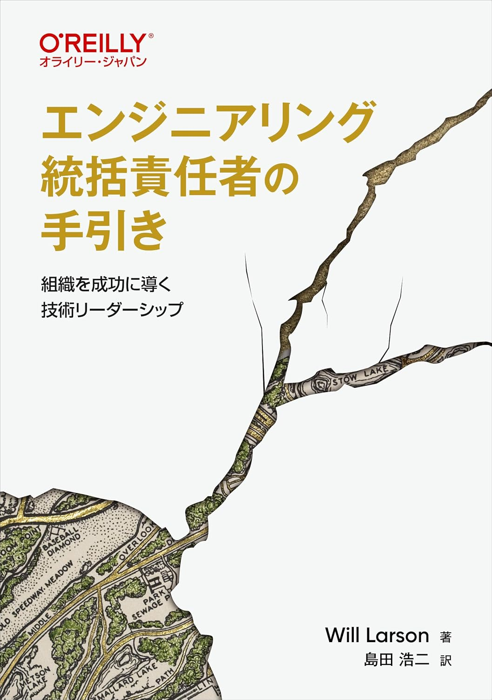
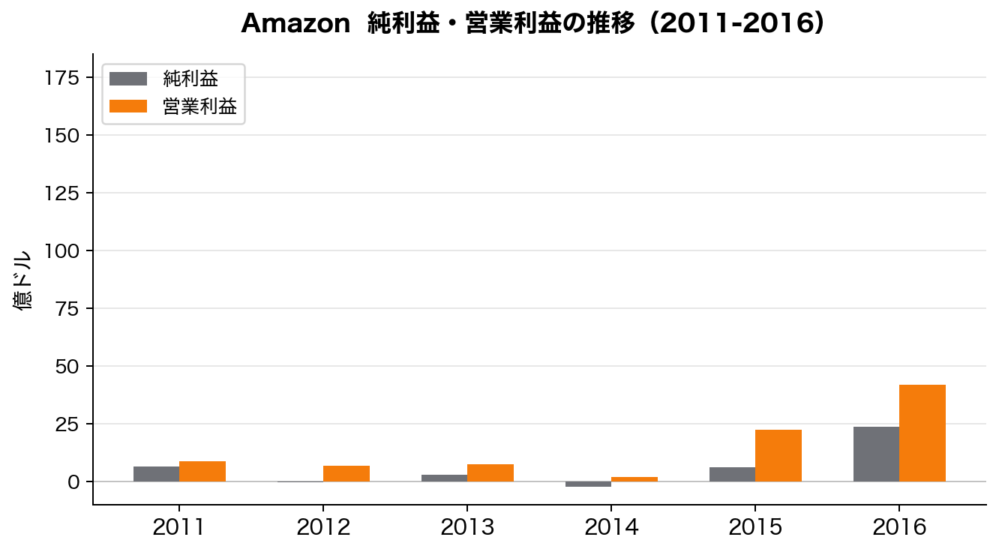
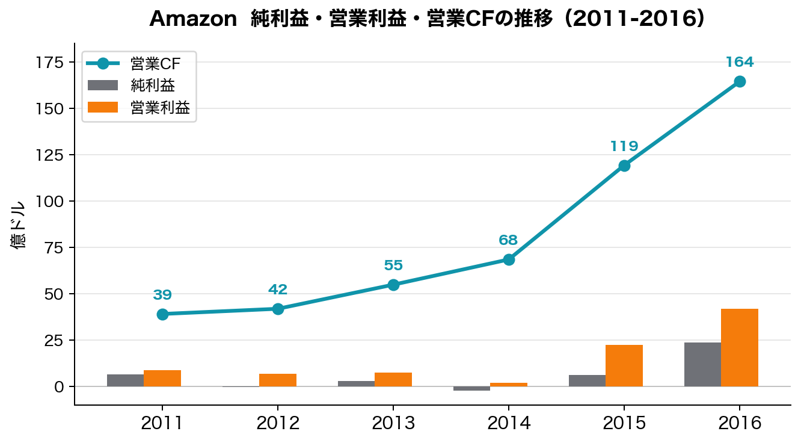
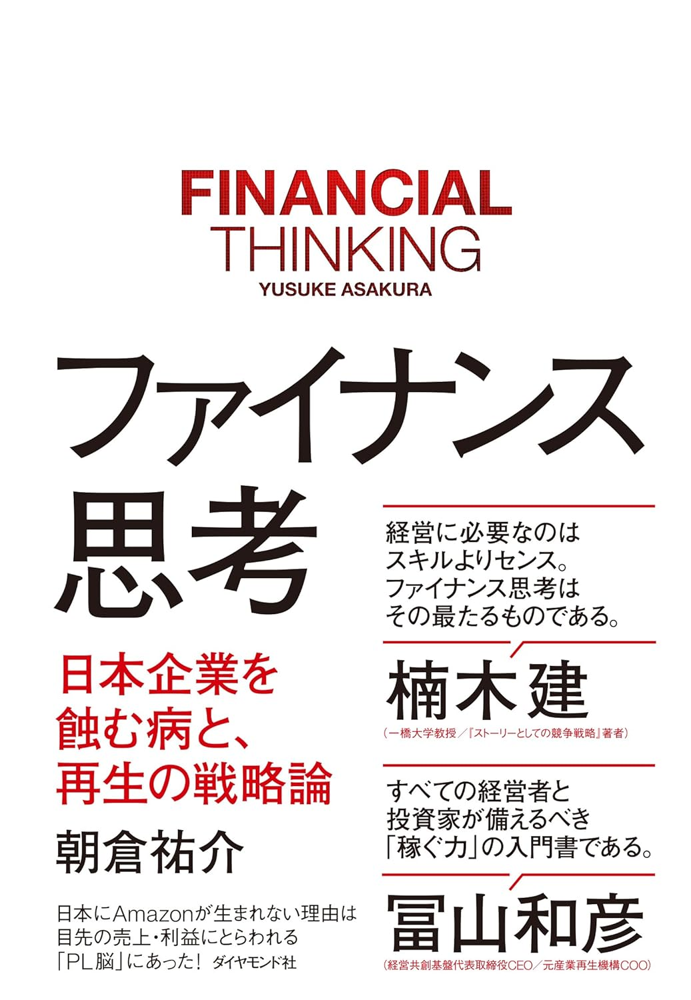
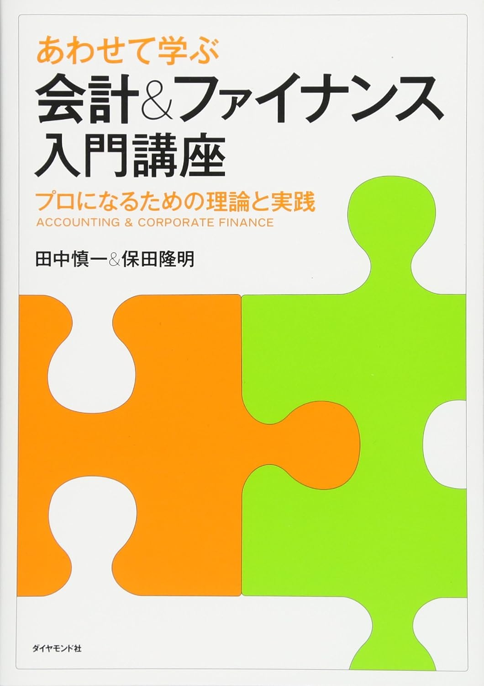

# 経営と会計とエンジニアリング

### EMConf 2026

### Kazuki Maeda

---
layout: center
class: text-center
---

## 今日は、経営・会計の視点から技術戦略を考える話をします

---
layout: center
class: text-center
---

# 想像タイム

---
layout: center
class: text-center
transition: fade
---

## お題：インフラ最適化の提案を経営に提案するシチュエーション

### どんなストーリーで提案しますか？

 

<v-click>

EC2ベースの基盤をECS Fargateに変更したいです

これにより、モダンなアーキテクチャで開発効率が上がります！！

</v-click>

---
layout: center
class: text-center
---

## お題：インフラ最適化の提案を経営に提案するシチュエーション

### どんなストーリーで提案しますか？

 

初期投資は 1,200万円、月次コストは 200万円削減

年間では 2,400万円の改善で、投資回収期間は6か月で、合理的です！！

---
layout: center
class: text-center
---

## それでも、通らないことがあるかも

 

ロジックは正しいはずなのに、どこか噛み合わない・・

---
layout: center
class: text-center
---

## なぜ「正しい提案」が通らないのか

 

[財務情報を正しく理解すれば、取るべき技術戦略が見える]{.accent}

今日はこの問いに対して、
考え方のフレームと実体験の両面からお話しします

---
layout: two-cols-header
class: split-card-slide
---

# 理想と現実のギャップ

::left::

### 理想

CEO/CFOから明確な方針が示される

- 「今期は営業が好調なので、攻めの新規事業開発に投資してほしい」
- 「来期はコスト削減フェーズなので、既存システムの効率化に集中を」

::right::

<v-click>

### 現実

方針が技術戦略まで結びつかない

- 経営陣は財務数値を提示するが、技術戦略への接続は示されない
- EM/VPが**自ら**財務状況を解釈し、技術戦略を描く必要がある

</v-click>

---
class: agenda-slide
---

# 今日お話しすること

1. **[技術戦略の出発点 -- 「戦略」の定義と財務視点]{.accent}**
2. 財務3表・CFパターンと技術戦略 -- 自社の状況を読み解く
3. 先行投資と財務のジレンマ -- 投資判断の考え方
4. AI時代の投資配分戦略 -- CFに基づく組織設計
5. まとめ -- 経営と会計とエンジニアリング

---
class: door-slide
---

# 技術戦略って何

---
class: with-right-image
---

# 技術戦略とは

> エンジニアリング戦略とは、次のことを定義するドキュメントだ
> -- 優先事項に対するリソース配分、基本ルール、意思決定方法

-- 『エンジニアリング統括責任者の手引き』p35

（なんとなく言ってることはわかりそう）

...

<v-click>

> 統括責任者になってから、財務計画こそがすべての会社の計画の基礎だということにようやく気づき、驚くことになる。

-- 『エンジニアリング統括責任者の手引き』p63

**[当時の自分にこの一文が乗しかかってきた]{.accent}**

</v-click>

---
layout: center
class: text-center
---

# では、技術戦略を考えるのに

# 必要な財務情報をどうやって手に入れるか？

---
class: agenda-slide
---

# 今日お話しすること

1. ~~技術戦略の出発点 -- 「戦略」の定義と財務視点~~
2. **[財務3表・CFパターンと技術戦略 -- 自社の状況を読み解く]{.accent}**
3. 先行投資と財務のジレンマ -- 投資判断の考え方
4. AI時代の投資配分戦略 -- CFに基づく組織設計
5. まとめ -- 経営と会計とエンジニアリング

---
class: door-slide
---

# 財務3表とエンジニアリング

---
transition: fade
---

# 財務情報をどこから仕入れるか

 

| 財務諸表 | 記載内容 | わかること |
|---|---|---|
| **P/L**（損益計算書） | 売上・費用・利益 | 「稼げているか？」 |
| **B/S**（貸借対照表） | 資産・負債・純資産 | 「どれだけ余裕があるか？」 |
| **C/S**（キャッシュフロー計算書） | 現金の出入り | 「お金が回っているか？」 |

 
 

### 会社・事業の状態を把握するための入口がこの3表

---

# CFに注目して考えてみる

 

| 財務諸表 | 記載内容 | わかること |
|---|---|---|
| **P/L**（損益計算書） | 売上・費用・利益 | 「稼げているか？」 |
| **B/S**（貸借対照表） | 資産・負債・純資産 | 「どれだけ余裕があるか？」 |
| **[C/S（キャッシュフロー計算書）]{.accent}** | [現金の出入り]{.accent} | [「お金が回っているか？」]{.accent} |

 
 

### **キャッシュは企業の生命線**{.accent} -- 利益が出ていてもキャッシュがなければ企業は倒れる

---
layout: center
class: text-center
---

## エンジニアの「事業貢献」を考える

 

「エンジニアも事業貢献を」と言われた時、P/L（売上・利益）をイメージしやすい

一方、基本的には会社が真に追っているのは**企業価値の最大化**

企業価値 ≒ 将来生み出すキャッシュフローの総和

**[だからこそ、CFを理解することが真の事業貢献の起点になる]{.accent}**

---
layout: center
class: text-center
---

## 「利益は意見、キャッシュは事実」

Profit is an opinion, cash is a fact

 

P/Lは会計方針で変わりうるが、CFは実際の現金の動きそのもの

---
transition: fade
---

# 例：Amazonの「赤字経営」の実態

 

「Amazonは長年赤字だった」と語られるが・・

- **純利益（P/L）** は長年赤字〜薄利だった
- **営業利益**も低水準で推移

 

P/Lだけを見ると「儲かっていない会社」に見える

---

# 例：Amazonの「赤字経営」の実態

 

しかし**営業CF**を重ねると景色が変わる

- 営業CFは**一貫してプラス**で、年々成長
- 稼いだキャッシュをAWS・物流等に即座に再投資していた
- Bezosは株主レターで「FCF最適化」を最重要指標と明言

 

**[「赤字企業」ではなく「稼いだキャッシュを全て再投資する積極投資型企業」]{.accent}**

---
class: door-slide
---

# キャッシュフローをざっくり理解

---
class: cf-card-slide
---

# キャッシュフロー計算書の3区分

  

    <h3>営業CF</h3>
    
本業での現金創出

    
▲  ：本業で現金を生み出せている

    
▼ ：本業で現金を消費している

  

  

    <h3>投資CF</h3>
    
設備投資・資産売却

    
▲ ：資産売却などの回収フェーズ

    
▼ ：将来に向けた投資フェーズ

  

  

    <h3>財務CF</h3>
    
借入・返済・資金調達

    
▲ ：借入などの外部資金流入

    
▼ ：返済・配当などの資金流出

  

---
class: cf-pattern-list-slide
---

# CFパターン一覧

 

| パターン | 営業CF | 投資CF | 財務CF | 技術戦略の方向性 |
|---|:---:|:---:|:---:|---|
| **優良型** | [▲]{.cf-table-arrow .is-plus} | [▼]{.cf-table-arrow .is-minus} | [▼]{.cf-table-arrow .is-minus} | 戦略的R&Dと人材育成を長期視点で |
| **積極投資型** | [▲]{.cf-table-arrow .is-plus} | [▼]{.cf-table-arrow .is-minus} | [▲]{.cf-table-arrow .is-plus} | 新規事業開発、M&A、R&D強化で攻める |
| **改善型** | [▲]{.cf-table-arrow .is-plus} | [▲]{.cf-table-arrow .is-plus} | [▼]{.cf-table-arrow .is-minus} | 選択と集中。コア技術領域に集中 |
| **安定型** | [▲]{.cf-table-arrow .is-plus} | [▲]{.cf-table-arrow .is-plus} | [▲]{.cf-table-arrow .is-plus} | 将来を見据えた戦略的投資。投資不足に注意 |
| **創業期型** | [▼]{.cf-table-arrow .is-minus} | [▼]{.cf-table-arrow .is-minus} | [▲]{.cf-table-arrow .is-plus} | MVP開発とPMF達成を最優先 |
| **リストラ型** | [▼]{.cf-table-arrow .is-minus} | [▲]{.cf-table-arrow .is-plus} | [▼]{.cf-table-arrow .is-minus} | 短期収益改善に直結する投資に限定 |
| **救済型** | [▼]{.cf-table-arrow .is-minus} | [▲]{.cf-table-arrow .is-plus} | [▲]{.cf-table-arrow .is-plus} | 事業転換が必要。新規技術領域への投資で転換 |
| **破綻危機型** | [▼]{.cf-table-arrow .is-minus} | [▼]{.cf-table-arrow .is-minus} | [▼]{.cf-table-arrow .is-minus} | 新規投資は凍結。事業再生に専念 |

---
layout: center
class: text-center
---

## 代表的な3パターンを深掘り

---
class: cf-pattern-detail-slide
transition: fade
---

# 深掘り：優良型の状態

<CFPatternDetail image-src="./images/cf_01.svg">

- 本業で安定的に現金を生み出している
- その資金を積極的に投資に回せている状態
- 技術戦略の**自由度が最も高い**フェーズ

**経営として最も健全な状態 -- この余力をどう活かすかが問われる**

</CFPatternDetail>

---

# 深掘り：優良型の技術戦略

 

## 将来のキャッシュを生む「攻めの投資」に注力{.accent}

### **技術戦略の注力ポイント例：**

- 次世代アーキテクチャへの刷新
- 新規事業向けプロダクト開発にリソースの大部分を配分
- 開発者体験（DevEx）向上への投資、中長期の技術人材採用

注意点：余裕があるからと言って、戦略性のない技術投資を乱発しないこと

---
class: cf-pattern-detail-slide
transition: fade
---

# 深掘り：創業期型の状態

<CFPatternDetail image-src="./images/cf_02.svg">

- まだ本業で稼げていない状態
- 資金調達（VC、借入など）で投資を進めている
- 手元資金は「いつか尽きる」前提で動く必要がある
- PMF（プロダクト・マーケット・フィット）達成が生存条件

**時間との勝負 -- 限られたキャッシュでPMFに到達できるかが勝負**

</CFPatternDetail>

---

# 深掘り：創業期型の技術戦略

 

## 負債を許容し、速く正しく前に進むことに注力{.accent}

### **技術戦略の注力ポイント例：**

- 技術的負債は意図的に許容し、高速に仮説検証を回す
- サードパーティサービスを最大限活用し、自前構築を最小化

---
class: cf-pattern-detail-slide
transition: fade
---

# 深掘り：リストラ型の状態

<CFPatternDetail image-src="./images/cf_03.svg">

- 本業が苦しく、現金を生み出せていない
- 資産売却で凌ぎつつ、借入返済を進めている
- コスト圧縮プレッシャーが直接エンジニアリング組織にかかる
- 長期的観点での技術投資は一時劣後もやむを得ない

**生存が最優先 -- まず体力を取り戻すことに集中する局面**

</CFPatternDetail>

---

# 深掘り：リストラ型の技術戦略

 

## 生存フェーズでは、打ち手の優先順位がすべて変わる{.accent}

### **技術戦略の注力ポイント例：**

- インフラコスト最適化 -- クラウドリソースの適正化、リザーブドインスタンス活用
- 不要なマイクロサービスの統廃合によるランニングコスト削減
- 売上に直結する機能改善に開発リソースを集中（解約率低減、アップセル支援）

 

<v-click>

ただし、生存のための施策に集中しつつも、**将来CFを生む種まきを完全にゼロにすることは高リスク**{.accent}

守り80-90%、種まき10-20% -- 小さくても将来投資を絶やさないことを意識する（後述）

</v-click>

---
layout: center
class: text-center
---

## 冒頭のインフラ最適化提案を思い出してください

 

<v-click>

自社のCFパターンが「優良型」で、**コスト削減より価値創出に重きを置きたい**時

投資回収期間6ヶ月、2400万円のコスト削減ではなく、

**新しい価値創出につながる活動**に注力して欲しい（かもしれない）

</v-click>

---

# 参考）よくあるミスマッチのパターン

 

| 会社のCF | ミスマッチ例 | 本来やるべきこと |
|---|---|---|
| **積極投資型**なのに | 守りのリアーキに全リソース投入 | 新規事業開発で成長機会を活かす |
| **創業期型**なのに | 完璧な技術スタックを追求 | MVP開発とPMF検証を最優先 |
| **優良型**なのに | 無計画にバズワード技術を導入 | 戦略的R&Dに集中する |
| **リストラ型**なのに | 長期R&D投資を継続 | コスト削減に集中しつつ、小さな種まきは残す |

 

**[会社・事業のphaseを知らずに技術戦略を立てると、「正論だが的外れ」な施策を取ってしまう]{.accent}**

---
class: agenda-slide
---

# 今日お話しすること

1. ~~技術戦略の出発点 -- 「戦略」の定義と財務視点~~
2. ~~財務3表・CFパターンと技術戦略 -- 自社の状況を読み解く~~
3. **[先行投資と財務のジレンマ -- 投資判断の考え方]{.accent}**
4. AI時代の投資配分戦略 -- CFに基づく組織設計
5. まとめ -- 経営と会計とエンジニアリング

---
layout: center
class: text-center
---

## CFパターンで方向性が見えた。

## しかし本当に「リストラ型なら投資を止めるべき」なのか？

 

<v-click>

再掲）生存のための施策に集中しつつも、**将来CFを生む種まきを完全にゼロにすることは高リスク**{.accent}

</v-click>

---

# CFが厳しいときの悪循環

<CFCycleFigure />

---
class: door-slide
---

# 先行投資と財務のジレンマ

---
class: card-only-slide
---

# 短期CFと長期価値のジレンマ

 

<DilemmaImpactCards />

 

## 技術の先行投資は、　将来の競争力を作る効果を持つ{.accent}

---
class: card-only-slide
---

# 例：Netflixの先行投資 -- 次の時代に賭け続けた企業

 

### Netflixは営業CFの伸びが鈍化するたびに、**次の時代を先取りする投資**{.accent}に踏み切ってきた

<NetflixInvestmentCards />

短期CFの悪化を受け入れてでも、次の成長曲線を作り続けた。**まさに「ジレンマを乗り越え続けた」事例**

---
layout: center
class: text-center
---

## ここまでの投資判断フレームを、

## 今最も大きな投資判断が求められている領域に適用する

---
layout: center
class: text-center
---

## ここまでの投資判断フレームを、

## 今最も大きな投資判断が求められている[AI投資]{.accent}に適用する

---
class: agenda-slide
---

# 今日お話しすること

1. ~~技術戦略の出発点 -- 「戦略」の定義と財務視点~~
2. ~~財務3表・CFパターンと技術戦略 -- 自社の状況を読み解く~~
3. ~~先行投資と財務のジレンマ -- 投資判断の考え方~~
4. **[AI時代の投資配分戦略 -- CFに基づく組織設計]{.accent}**
5. まとめ -- 経営と会計とエンジニアリング

---
class: door-slide
---

# AI時代の投資配分戦略

---
class: card-only-slide
---

# AI時代に変わること

 

### AIにより、技術投資の「中身」が変わりつつある

 

<AiChangePointsCards />

 

### **[投資意思決定サイクルの高速化が必要になってきている]{.accent}**

---

# 動的配分サイクル：四半期ごとの見直し

 

### AIはボトルネックの移動を加速させるため、配分見直しの頻度を上げる必要がある

 

<QuarterlyReviewStepsCards />
 

コード生成が速くなるほどレビュー・QA・ガバナンスが詰まりやすくなる。

時代に合わせた開発スタイルを実現するための最適な投資の解を探す。

---
class: agenda-slide
---

# 今日お話しすること

1. ~~技術戦略の出発点 -- 「戦略」の定義と財務視点~~
2. ~~財務3表・CFパターンと技術戦略 -- 自社の状況を読み解く~~
3. ~~先行投資と財務のジレンマ -- 投資判断の考え方~~
4. ~~AI時代の投資配分戦略 -- CFに基づく組織設計~~
5. **[まとめ -- 経営と会計とエンジニアリング]{.accent}**

---

# まとめ

 

**[CFパターンを読めば、EMとして取るべき技術戦略が見える]{.accent}**

**1. CFパターンを理解する**

自社のCFパターンを特定し、今どのフェーズにいるかを把握する。CFOに営業CFを聞くことから始めよう

**2. 先行投資の重要性を知る**

CFが厳しい時でも種まきを止めない。営業CFが健全な時こそ、将来への投資を提案する最大のチャンス

**3. 経営の言葉で提案する**

技術の正しさだけでなく、CFの言葉に変換して投資の必要性を語る。それが提案を通す鍵になる

**[その一歩が、経営と技術をつなぐ起点になる]{.accent}**

---
layout: center
class: text-center
---

## 経営の言葉を知ることは、技術の価値を届けること

**[その一歩が、経営と技術をつなぐ起点になる]{.accent}**

---
class: sns-link-slide
internal: true
---

# ありがとうございました

  
  
Kazuki Maeda

  

    
    
<svg class="sns-logo" viewBox="0 0 24 24"><path d="M18.244 2.25h3.308l-7.227 8.26 8.502 11.24H16.17l-5.214-6.817L4.99 21.75H1.68l7.73-8.835L1.254 2.25H8.08l4.713 6.231zm-1.161 17.52h1.833L7.084 4.126H5.117z"/></svg>

    
@kzk_maeda

  

  

    
    
<svg class="sns-logo" viewBox="0 0 24 24"><path d="M20.447 20.452h-3.554v-5.569c0-1.328-.027-3.037-1.852-3.037-1.853 0-2.136 1.445-2.136 2.939v5.667H9.351V9h3.414v1.561h.046c.477-.9 1.637-1.85 3.37-1.85 3.601 0 4.267 2.37 4.267 5.455v6.286zM5.337 7.433a2.062 2.062 0 01-2.063-2.065 2.064 2.064 0 112.063 2.065zm1.782 13.019H3.555V9h3.564v11.452zM22.225 0H1.771C.792 0 0 .774 0 1.729v20.542C0 23.227.792 24 1.771 24h20.451C23.2 24 24 23.227 24 22.271V1.729C24 .774 23.2 0 22.222 0h.003z"/></svg>

    
kzk-maeda

  

---
class: book-ref-slide
internal: true
---

# おすすめ書籍

 

  

    
    

      
ファイナンス思考

      
「P/L脳」から脱却し、企業価値を長期で捉える視座を得られる一冊 前々職の上司がくれた本。5週は読みました。

    

  

  

    
    

      
決算分析の地図

      
財務3表の数字からビジネスモデルの構造を読み解く実践的な分析手法 基礎的な内容を企業の実例ベースで紹介してくれ、読みやすい。

    

  

  

    
    

      
財務3表一体理解法

      
P/L・B/S・C/Sのつながりをゼロから理解できる定番入門書。シリーズで読むのがおすすめ 他の入門書の後に手に取ると理解しやすいかも。

    

  

  

    
    

      
会計&ファイナンス入門講座

      
会計とファイナンスの違いと全体像を一冊で俯瞰できる入門書 これで初めてNPV、DCF法をちゃんと理解できました。

    

  

