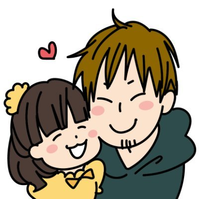
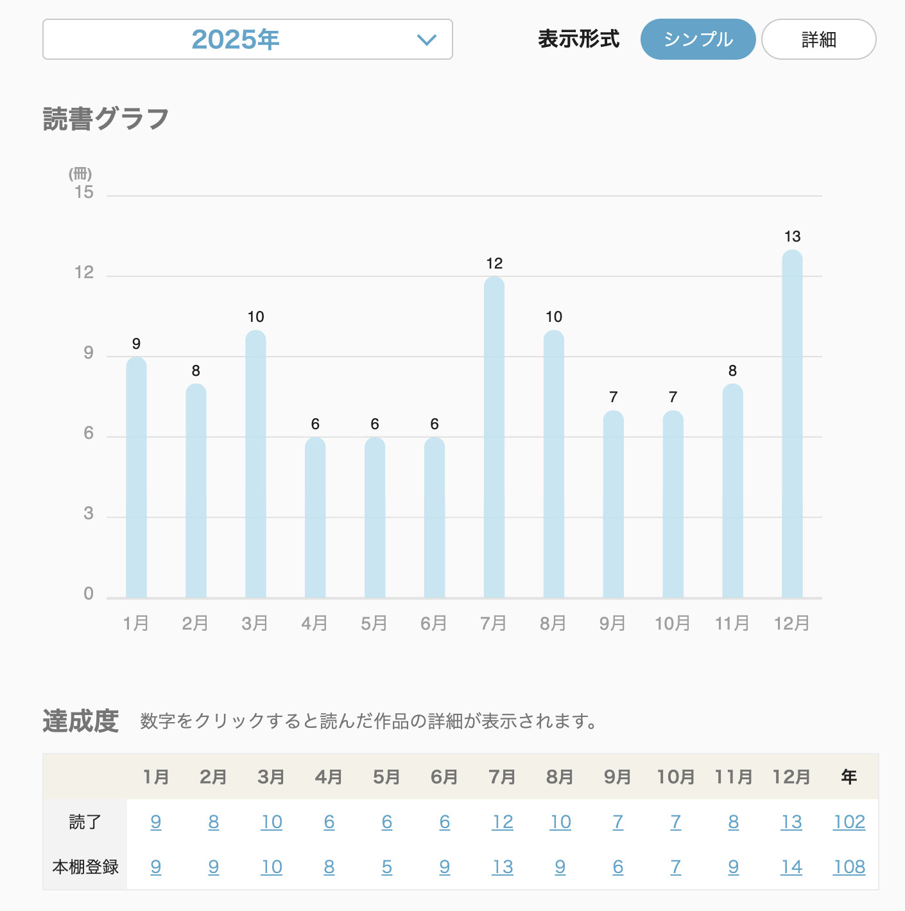
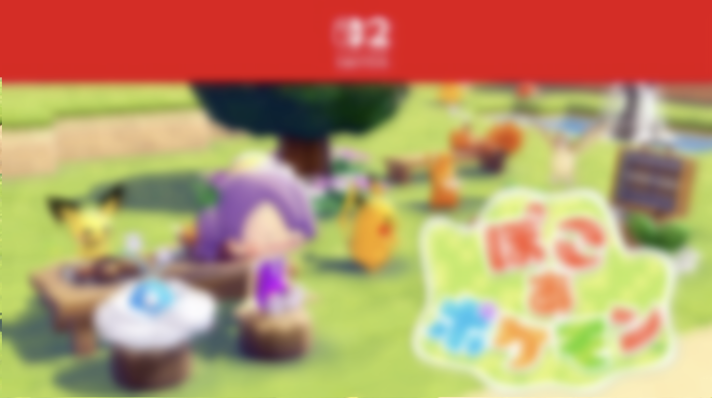
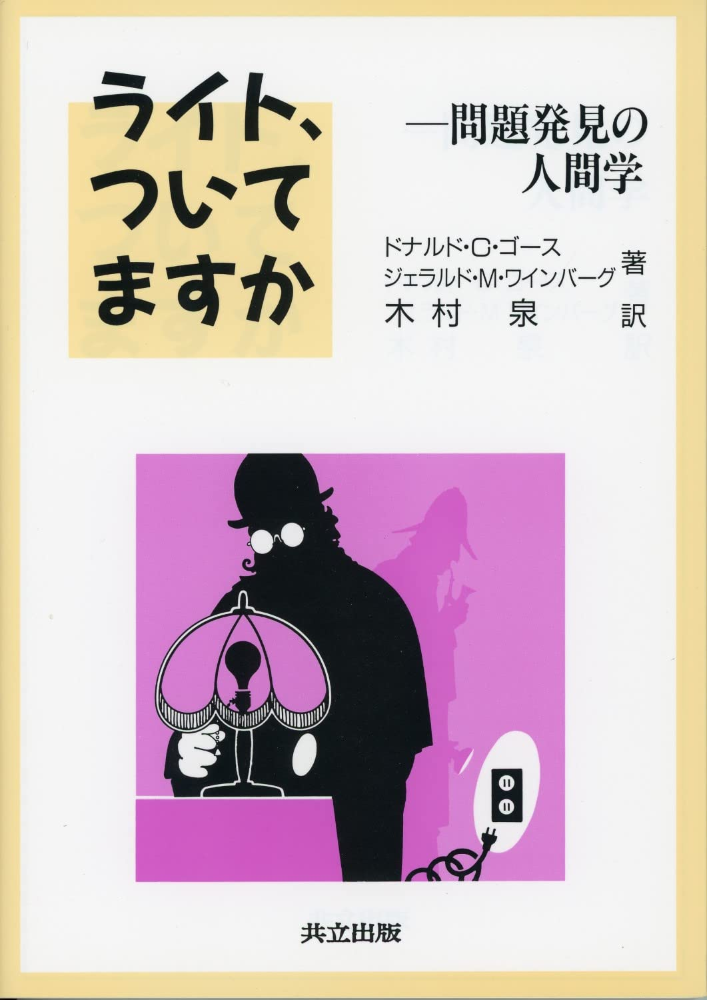

# EMが「推し本」を語る会

## 『ライト、ついてますか』

### Kazuki Maeda

---
class: self-intro-grid
---

  
ABOUT ME

  
  
Kazuki Maeda

  <h2>自己紹介</h2>
  <ul>
    <li>atama plus株式会社 VPoE/技術統括</li>
    <li>リクルート→EdTechスタートアップ→現職</li>
    <li>EMConf 2025/2026で登壇しました</li>
    <li>好きなこと：読書、ギター、キックボクシング</li>
  </ul>
  

    
    
<svg class="self-intro-x-logo" viewBox="0 0 24 24"><path d="M18.244 2.25h3.308l-7.227 8.26 8.502 11.24H16.17l-5.214-6.817L4.99 21.75H1.68l7.73-8.835L1.254 2.25H8.08l4.713 6.231zm-1.161 17.52h1.833L7.084 4.126H5.117z"/></svg> @kzk_maeda

  

---
class: door-slide
---

# どのくらい本読んでますか？

---
layout: center
---

{.booklog-image}

---
layout: center
class: text-center
---

{.booklog-image}

ちょっと今年は厳しいかも

---
class: agenda-slide
---

# 今日お話しすること

1. **[僕の推し本]{.accent}**
2. なぜこの本を推すのか
3. おすすめポイントと注意点

---
class: door-slide
---

# 僕の推し本

---
class: with-right-image
---

# 「ライト、ついてますか」

**ライト、ついてますか -- 問題発見の人間学**

- 著者：ドナルド・C・ゴース、ジェラルド・M・ワインバーグ
- 初版：1987年（原著は1982年）
- かなり昔の本でありながら、本質を突き、語り継がれている名著

 

「問題解決」ではなく **[「問題発見」]{.accent}** の本

---

# 有名な類書との違い

 

「問いを立てる」ことの重要性を説く本は他にもある

- 「イシューからはじめよ」-- 論理的にイシューを特定するアプローチ
- 本書 -- **エピソードベース** で「問題とは何か」を問い直す

 

本書のユニークさは、**答えを出す方法論ではなく、そもそも「何が問題なのか」を多角的に考えさせる** ところにある

<!-- TODO: 本の中から印象的なエピソードや引用を1-2個ピックアップして追加 -->
<!-- 例: 「問題とは、望まれた事柄と認識された事柄の間の相違である」など -->

---
class: agenda-slide
---

# 今日お話しすること

1. ~~僕の推し本~~
2. **[なぜこの本を推すのか]{.accent}**
3. おすすめポイントと注意点

---
class: door-slide
---

# なぜこの本を推すのか

---

# 「推し本」の選定軸

 

「おすすめの本は？」と聞かれたとき、いくつかの軸がある

- 人間関係について示唆を与える本？
- 組織課題の解決に寄与する本？
- テクニカルなスキルを身につけられる本？

 

<v-click>

本棚を見返しながら考えた結果...

**[より仕事人として「普遍的に」活用できる本]{.accent}** を選びたいと思った

</v-click>

---

# 「問題発見」はEMにとって重要なスキル

 

マネジメントというロールを担うようになると、扱う課題の性質が変わる

- 課題の **抽象度** が上がる
- そもそも **問いを立てる** ところから必要になる
- 「答えを出す力」より **「問いを見つける力」** が求められる

 

この本は、その **「問いを見つける力」** を鍛えてくれる

---

# AI時代に一層価値が増している

 

### 問題解決

- 定型的な分析・処理
- パターンマッチング
- 大量データの処理

**AIが得意な領域**

### 問題発見

- 「何が問題か」を定義する
- 文脈や意図を汲み取る
- 曖昧な状況を構造化する

**[人間が担うべき領域]{.accent}**

<!-- TODO: 具体的なAI活用の実体験や事例があれば追加 -->

---
class: agenda-slide
---

# 今日お話しすること

1. ~~僕の推し本~~
2. ~~なぜこの本を推すのか~~
3. **[おすすめポイントと注意点]{.accent}**

---
class: door-slide
---

# おすすめポイントと注意点

---

# おすすめポイント

 

各エピソードで、一つの問題が **多面的に** 捉え直される

- ある視点から「これが問題だ」と思っていたことが、別の視点から見ると全く違う問題になる
- その **裏切りが繰り返される** 構成は、多重解決ミステリーに近い体験
- そんなエピソードがいくつも詰まっている

 

読み進めるうちに、**[自分の「問題の捉え方」そのものが揺さぶられる]{.accent}**

---

# 読む前に知っておくと良いこと

 

- **和訳が独特** -- 原著の味を残そうとした結果、少し読みにくい箇所がある
- **エピソードがアメリカンドラマ調** -- 日本の文脈だとスッと入ってこないことも

<v-click>

こういった愛嬌も含めて、読書の楽しさだと思って薦めている

</v-click>

---
class: door-slide
---

# まとめ

---

# まとめ

 

- 「ライト、ついてますか」は、問題発見の本質をエピソードで伝える一冊
- EMとして **問いを立てる力** を磨くのに最適
- AI時代において、**「何が問題か」を見つける力** は一層価値を増している

 

**[ぜひ本棚の一冊に加えてみてください]{.accent}**

---
class: sns-link-slide
internal: true
---

# ありがとうございました

  
  
Kazuki Maeda

  

    
    
<svg class="sns-logo" viewBox="0 0 24 24"><path d="M18.244 2.25h3.308l-7.227 8.26 8.502 11.24H16.17l-5.214-6.817L4.99 21.75H1.68l7.73-8.835L1.254 2.25H8.08l4.713 6.231zm-1.161 17.52h1.833L7.084 4.126H5.117z"/></svg>

    
@kzk_maeda

  

  

    
    
<svg class="sns-logo" viewBox="0 0 24 24"><path d="M20.447 20.452h-3.554v-5.569c0-1.328-.027-3.037-1.852-3.037-1.853 0-2.136 1.445-2.136 2.939v5.667H9.351V9h3.414v1.561h.046c.477-.9 1.637-1.85 3.37-1.85 3.601 0 4.267 2.37 4.267 5.455v6.286zM5.337 7.433a2.062 2.062 0 01-2.063-2.065 2.064 2.064 0 112.063 2.065zm1.782 13.019H3.555V9h3.564v11.452zM22.225 0H1.771C.792 0 0 .774 0 1.729v20.542C0 23.227.792 24 1.771 24h20.451C23.2 24 24 23.227 24 22.271V1.729C24 .774 23.2 0 22.222 0h.003z"/></svg>

    
kzk-maeda

  

