<!-- _class: title -->
# モノリスの認知負荷に立ち向かう
## コードの所有者という思想と現実

---


# 自己紹介


- 前田 和樹（kzk_maeda）
- atama plus株式会社 VPoE / 技術フェロー
- データや機械学習、生成AIに関する開発
---

<!-- _class: agenda -->
# アジェンダ

* <span class="current">事業成長に伴い直面した開発課題</span>
* <span class="current">「コードを所有する」という考え方と取り組み</span>
* <span class="current">「コードを所有する」状態と組織柔軟性の課題</span>
* <span class="current">所有者運用と組織柔軟性の最大公約数</span>
* <span class="current">まとめ</span>

---

<!-- _class: agenda -->
# アジェンダ

* <span class="current">事業成長に伴い直面した開発課題</span>
* <span class="dimmed">「コードを所有する」という考え方と取り組み</span>
* <span class="dimmed">「コードを所有する」状態と組織柔軟性の課題</span>
* <span class="dimmed">所有者運用と組織柔軟性の最大公約数</span>
* <span class="dimmed">まとめ</span>

---

# 背景：スタートアップの成長

- シンプルなプロダクト・小さなチームからスタート

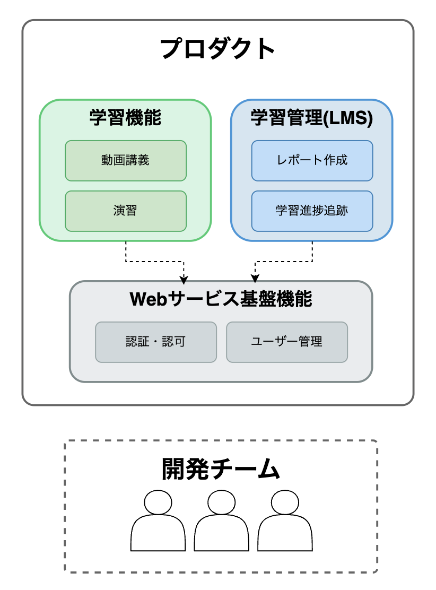

---

# 背景：スタートアップの成長

- 事業成長に伴い、機能・エンジニアが増加
- 一方、コードベースはモノリシックアーキテクチャを維持
  - 単純なモノリスではなく、モジュラーモノリスを志向した成長
  - 分割するコストと時間の制約
  - ビジネス成長スピードの優先

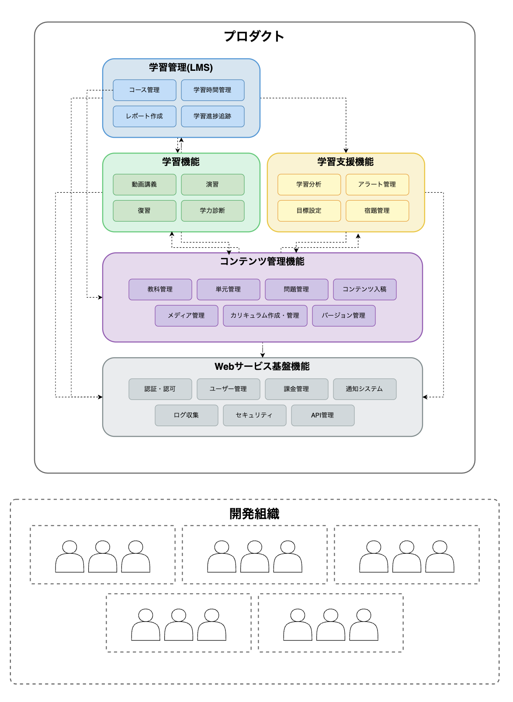

---

# 2022年：事業の多角展開
- 事業の多角化戦略
  - 同一のコードベースで複数の顧客・事業への展開
- 短期での事業立ち上げを最小の痛みで実現する必要性

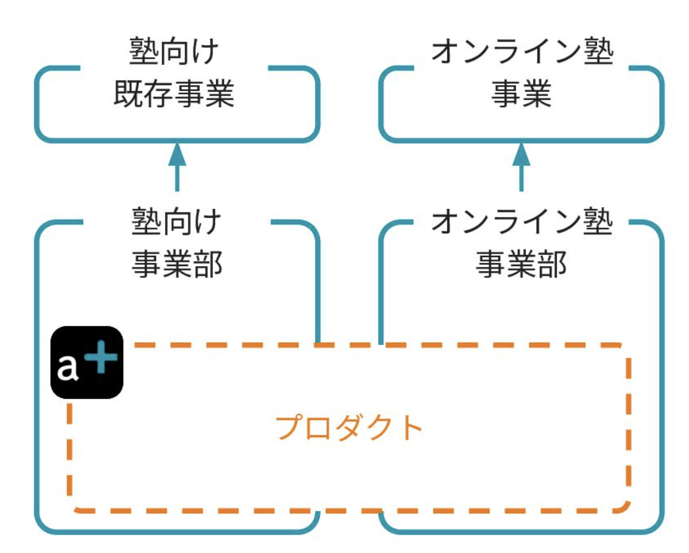

<!-- https://speakerdeck.com/atamaplus/akitekutodan-sheng-tokorekara-sutatoatupu-7nian-nocheng-chang-totong-mi?slide=62 -->

---

# 直面した課題

- **認知負荷の増大**
  - 「全部を全員で見切れない」
- **開発コンフリクトの頻発**
  - 新事業：高速な価値検証
  - 既存事業：安定した価値提供
- **チーム間調整コストの爆発的増加**
  - 新事業での変更が既存事業では不要
  - 顧客コミュニケーションコスト


---

# 対話での回避

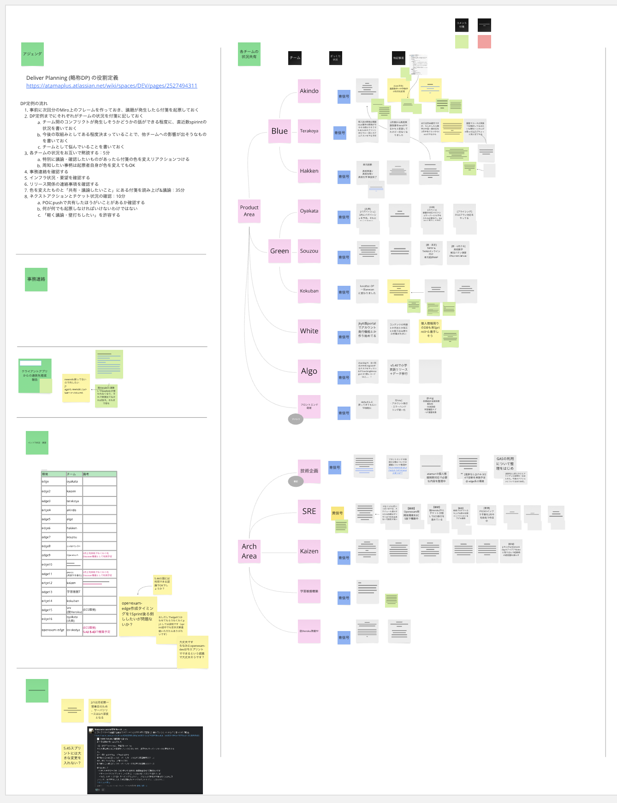

- 開発負荷増大に対して、チーム間で開発についてsyncする場を定期的に設けて対応
- 一定の効果は得られたものの、中長期的な知識の醸成やコンフリクト防止の課題は依然残る

---

<!-- _class: agenda -->
# アジェンダ

* <span class="dimmed">事業成長に伴い直面した開発課題</span>
* <span class="current">「コードを所有する」という考え方と取り組み</span>
* <span class="dimmed">「コードを所有する」状態と組織柔軟性の課題</span>
* <span class="dimmed">所有者運用と組織柔軟性の最大公約数</span>
* <span class="dimmed">まとめ</span>

---

# 「コードの所有」とは

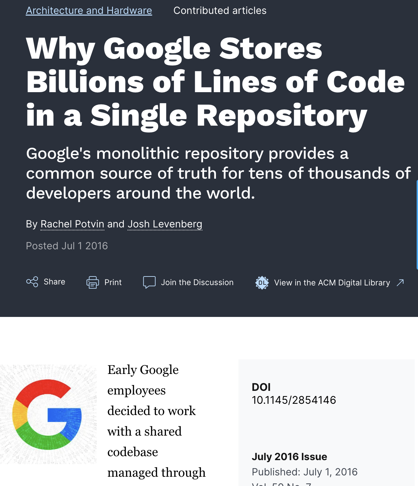

- コードの各部分に明確な「所有者」を設定する
- 所有者は**そのコードについての最終責任**を持つ
- Googleなどの大規模組織でも実践されている手法
  - 「Code Ownership」の考え方
  - ファイルレベルでのオーナーシップ
  - レビューやメンテナンスの責任の明確化


<div class="reference">
https://cacm.acm.org/research/why-google-stores-billions-of-lines-of-code-in-a-single-repository/
</div>

---

# コード所有者モデル

コードの各部分に明確な「所有者」を設定する開発ルール

```
src/
├── module_a/                
│   ├── feature_1/           # Product Team A
│   └── feature_2/           # Product Team B
├── module_b/                # Product Team C
│   └── submodule/           # Product Team D
└── shared/                  # Platform Team
```

- 所有の単位はmoduleだったり、コードファイル単位だったり
- 実態に合わせて設計する必要がある

---

# 所有者モデルの設計

- チームをストリームアラインドに区切る
  - 事業・サービス単位での機能責任
  - ドメイン知識の集約
- 関連するコードの所有
  - ドメイン関連コードの明確な割り当て
  - チーム間の責任境界の設定

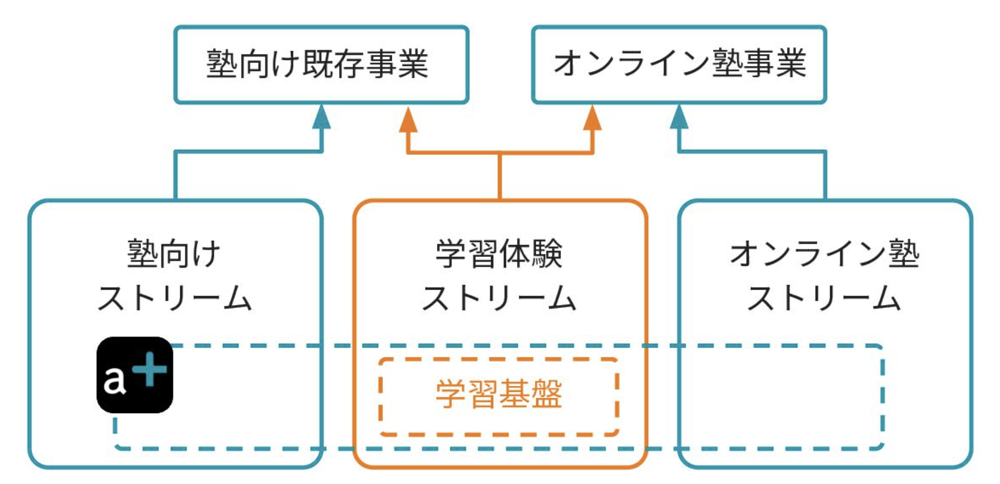

---

# 導入プロセス

1. コードベース分析と所有エリアのマッピング
2. クロスエリア開発のためのガイドライン策定
   - 事前相談ルール
   - レビュー依頼フロー
3. シームレスな所有者の管理・可視化
   - メタデータファイルの配置
   - エディタ拡張の開発

---

# 導入プロセス
## コードベース分析と所有エリアのマッピング
- プロダクトの機能/module/APIの粒度で、どのエリアが所有するものかを整理
- 所有関係・依存関係を一覧にして可視化

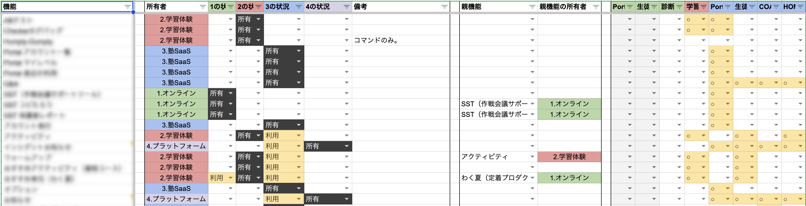

---

# 導入プロセス
## クロスエリア開発のためのガイドライン策定
- 所有をまたがる変更を他チームから行いたい場合、所有チームに相談する
- 何をトリガーに所有者に相談するかのガイドラインなど制定

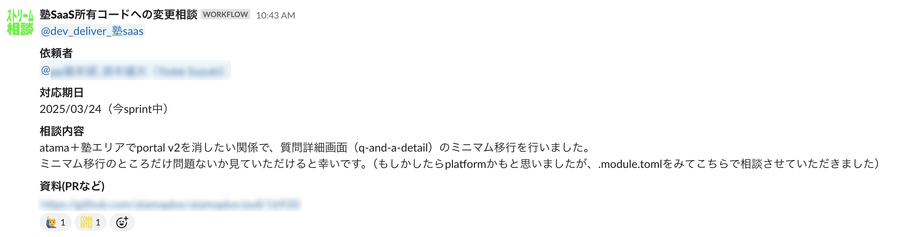

---

# 導入プロセス
## コード所有の可視化


- エディタでコードファイルを開くと
  所有エリアが表示される拡張の提供

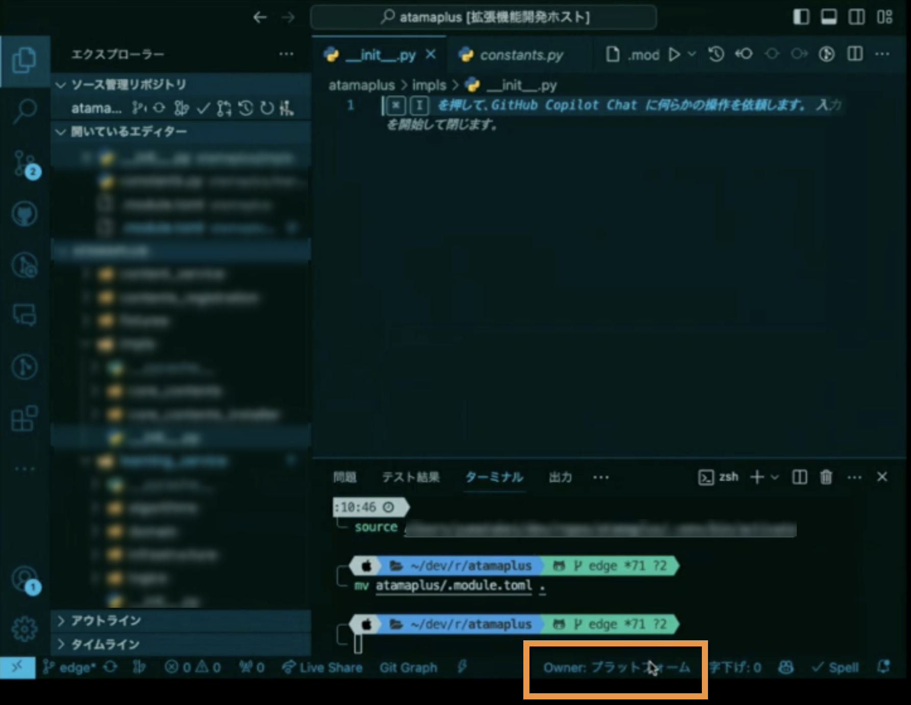

---

# 導入プロセス
## コード所有の可視化

- 敬虔なVimmerが作成した拡張も

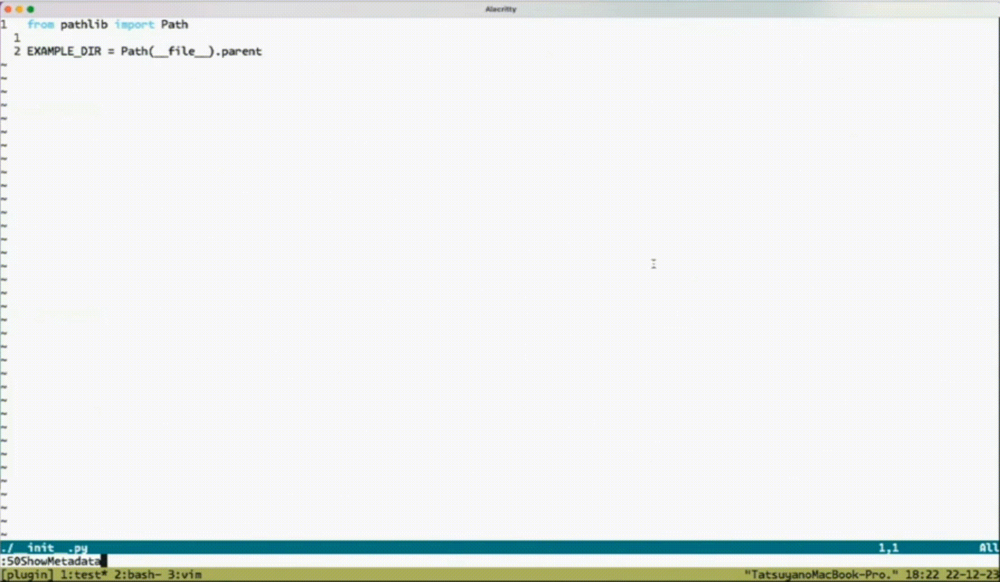

---

# 初期の成果

- **認知負荷の軽減**
  - 自分のチームが所有するコードの変更に対する安全性が向上
  - 所有していないコードに関しても「誰に聞けばいいか」の明確化
- **品質維持活動の効率化**
  - トリアージしたバグのアサインを機械的に実施
  - 特にDevOpsの中で、検知したエラーの担当アサインに迷わなくなった

---

<!-- _class: agenda -->
# アジェンダ

* <span class="dimmed">事業成長に伴い直面した開発課題</span>
* <span class="dimmed">「コードを所有する」という考え方と取り組み</span>
* <span class="current">「コードを所有する」状態と組織柔軟性の課題</span>
* <span class="dimmed">所有者運用と組織柔軟性の最大公約数</span>
* <span class="dimmed">まとめ</span>

---

# 直面した課題

- **負荷の偏り**
  - 活発な開発領域 vs. レガシー領域
  - メンテナンス負荷の不均衡

- **技術的負債の責任**
  - 「継承した負債」に対する抵抗感

- **クロスカッティングな変更の複雑化**
  - チームを跨る変更の調整コスト

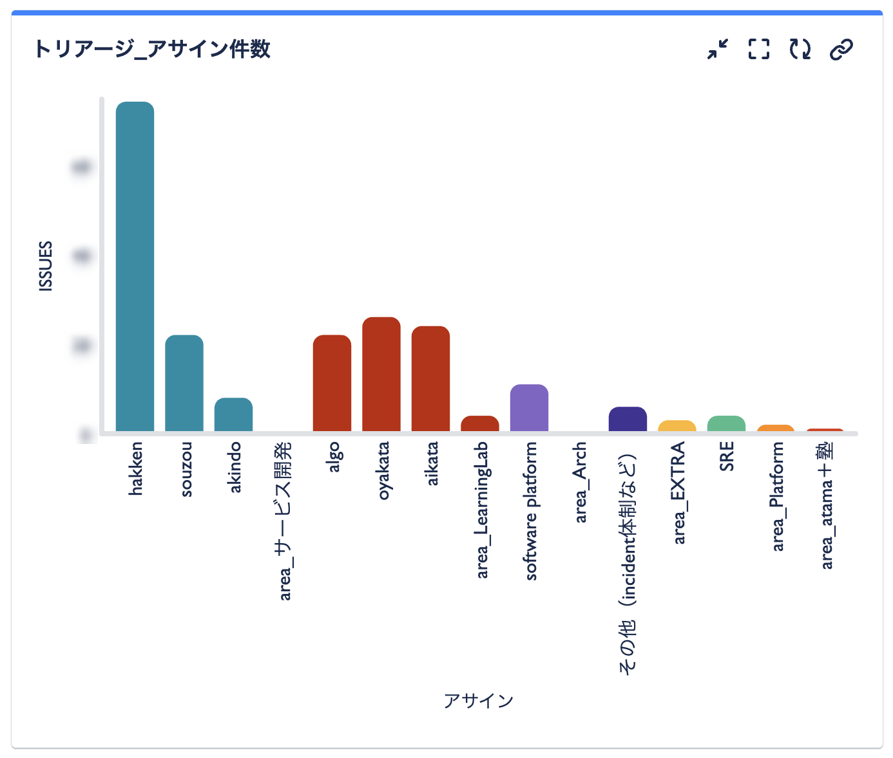

---

# 組織変更とのコンフリクト

- **事業戦略変更による組織再編**
  - 事業戦略に合わせ、チーム統合・分割、新規事業立ち上げなどが必要になる

- **所有者移管の難しさ**
  - 組織変更と合わせて、コードの知識移転を行うコストが着いて回る
  - 組織変更の影響で、事実上所有者が不在となるコードが現れる

---

# 課題の事例

- 事業Aに注力し、事業Bから人をアサインしたいという組織変更
- 事業Bが所有しているコードには、事業Aに依存されているものも多数
- 人が少なくなるが、依存されるコードが多く存在するケースに、どう立ち向かえばいいのか？？

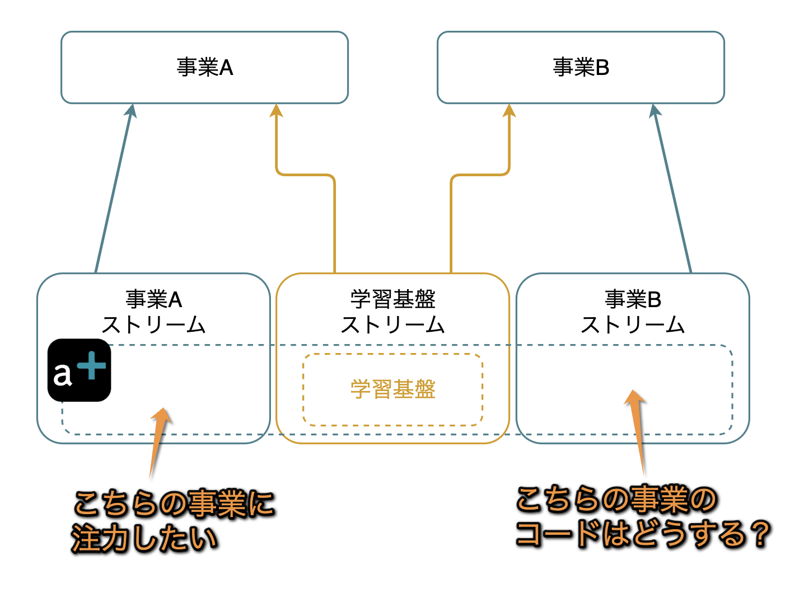

---

## 余談:マイクロサービス化？

- この手の話でよく上がる解決策だが・・
- マイクロサービスは必ずしも答えではない
  - 分割コストの高さ
  - 運用複雑性の増大
  - 組織規模とのバランス
  - サービス所有の問題は残る

- **→ モノリス内での改善を模索**

<div class="reference">
https://blog.container-solutions.com/why-im-no-longer-talking-to-architects-about-microservices
</div>


---

<!-- _class: agenda -->
# アジェンダ

* <span class="dimmed">事業成長に伴い直面した開発課題</span>
* <span class="dimmed">「コードを所有する」という考え方と取り組み</span>
* <span class="dimmed">「コードを所有する」状態と組織柔軟性の課題</span>
* <span class="current">所有者運用と組織柔軟性の最大公約数</span>
* <span class="dimmed">まとめ</span>

---

## 以降は現在挑戦中の新しい所有運用についてです

---

# 新しいアプローチ：
### **領地と領主**

- 従来の**静的な所有権**から**動的な管理責任**へ

- **領地 (Territory)**
  - 事業ドメインに基づくコード領域
  - 機能的なまとまりを優先

- **領主 (Lord)**
  - 変更管理の責任を持つチームまたは個人
  - 一定の単位で一時的に任命可能


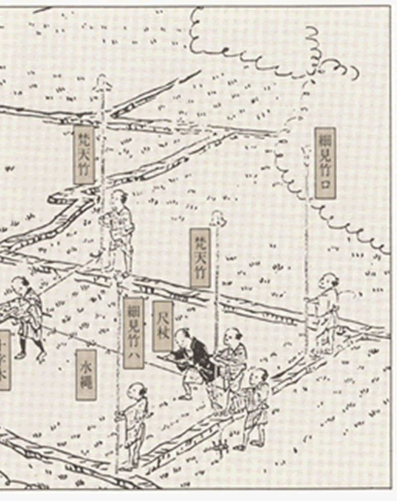

---

# 領主の整理

コードを事業ドメインでなく、**被依存度**と**変更頻度**、**複雑度**の軸で整理

1. **被依存度が低く、変更頻度も低い**
2. **被依存度が高く、変更頻度は低い**
3. **変更頻度が高い**
4. **複雑性が高い**


---

# 領主の整理

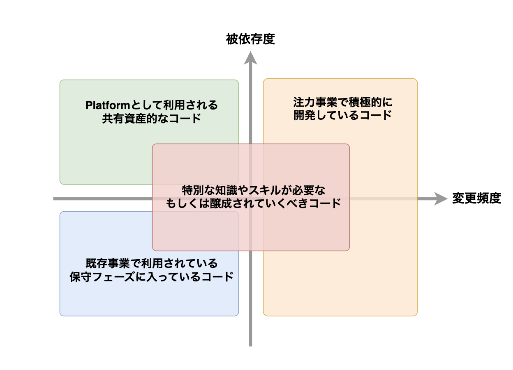

---

# 領主の整理

<div class="flex fw">
<div style="--fw: 1;">

### **被依存度が低く、変更頻度も低い**
   - 保守Phaseに入った機能、コード
   - 積極的に体制はつけないが、
     知識承継と運用保守のガイドは決める

### **被依存度が高く、変更頻度は低い**
   - Platform的に複数事業で利用されるコード
   - 所有コストを下げることを目的とした
     チームで所有する

</div>

<div style="--fw: 1;">

### **変更頻度が高い**
   - 注力事業で積極的に開発しているコード
   - 事業チームのエンジニアで所有する
<br>

### **複雑性が高い**
   - Complicated Subsystemの要素が強いコード
   - 特殊な知識を要するケースが多いため、
     安定したチームで所有し、知識醸成を狙う

</div>
</div>

---

# 「領地と領主」モデルで狙う利点

- **組織変更への適応性**
  - 領主の交代が容易
  - 事業変化に合わせた柔軟な責任移管
- **明確な責任分担**
  - コードの「住所=事業ドメインに紐づく領地」は変わらない
  - 管理責任=領主だけを移行
- **オーナーシップの促進**
  - 単なる「担当」から「責任ある管理」へ
  - 一時的な領主としての改善インセンティブにも寄与させたい

---

<!-- _class: agenda -->
# アジェンダ

* <span class="dimmed">事業成長に伴い直面した開発課題</span>
* <span class="dimmed">「コードを所有する」という考え方と取り組み</span>
* <span class="dimmed">「コードを所有する」状態と組織柔軟性の課題</span>
* <span class="dimmed">所有者運用と組織柔軟性の最大公約数</span>
* <span class="current">まとめ</span>

---

# まとめ

1. 事業成長の中で**認知負荷の軽減**が重要課題に
2. **コード所有権モデル**で成果を得るも、**組織変更**との衝突に直面
3. 領域の**状態**に応じた領主の割り当てで柔軟性を確保
4. **領地(Territory)と領主(Lord)の分離**がモノリス運用の新しい形
5. 変更頻度や被依存度に基づいた**動的な所有構造**へ

---

# 学びと今後の展望

- **コード所有は思想だけでなく運用の問題**
  - 単にルールを決めるだけでは不十分
  - 組織変化に対応できる柔軟な仕組みが必要
- **マルチ事業展開への対応**
  - 事業ごとの変更速度とリスク許容度の違いを調整
  - 共通部分と変動部分の境界線設計
- **技術と組織の共進化**
  - コードの構造と所有者モデルを同時に進化させる
  - 「領地と領主」という概念を文化として定着させる

---


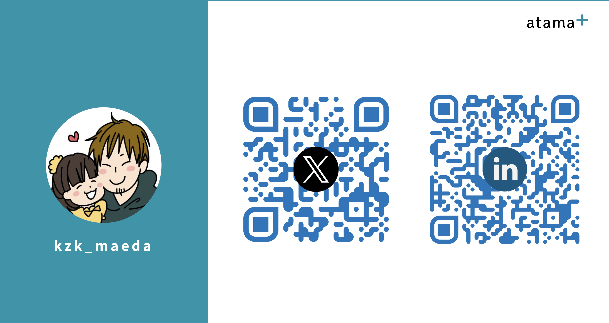
