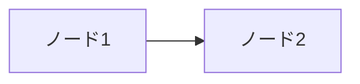

# sli.dev スライド作成の知見

## 概要
このドキュメントは、sli.dev（Slidev）を使用してプレゼンテーション資料を作成する際に得られた知見をまとめたものです。

## 基本的な注意点

### 1. HTMLタグの使用は最小限に
- sli.devはMarkdownベースのツールなので、できるだけ純粋なMarkdownで記述する
- HTMLタグ内でMarkdownリスト記法を使うとパースエラーが発生することがある
- 特に`<div>`内で`- リスト項目`を使うと、`<li>`タグとして誤認識される

### 2. レイアウトの使い方

#### two-cols-header レイアウト
```markdown
---
layout: two-cols-header
class: flex flex-col
---

# タイトル

左側のコンテンツ

::right::

右側のコンテンツ
```

#### 垂直中央配置
```markdown
---
class: flex flex-col
---

# タイトル

<div class="flex-grow flex items-center justify-center">
<div>
コンテンツ
</div>
</div>
```

### 3. 画像の配置

#### layout: image-right/image-left
- 画像が大きすぎる場合がある
- 代替案として`two-cols`レイアウトを使用し、画像をMarkdownで配置

#### 画像サイズの制御
```markdown
# HTMLタグを使う場合（非推奨）


# スタイルタグで制御（推奨）
<div style="max-width: 600px; margin: 0 auto;">


</div>
```

### 4. 背景画像の設定

#### フロントマターでの設定（タイトルスライドのみ）
```markdown
---
background: ./images/background.jpg
---
```

#### 個別スライドでの背景設定
フロントマターの`background`プロパティが効かない場合は、スタイルセクションを使用：

```markdown
---
layout: center
---

# タイトル

<style>
.slidev-layout {
  background-image: url('./images/background.jpg');
  background-size: cover;
  background-position: center;
}
</style>
```

### 5. 文字色の変更
背景画像使用時など、文字色を変更する場合：

```markdown
<style>
.slidev-layout h1,
.slidev-layout h2,
.slidev-layout h3,
.slidev-layout p {
  color: white !important;
}
</style>
```

## トラブルシューティング

### 1. two-cols-header レイアウトの問題
- `class: flex flex-col`と併用すると、コンテンツが下部に配置される
- 解決策：通常の`default`レイアウトと`grid`を使用

```markdown
---
layout: default
---

# タイトル

<div class="grid grid-cols-2 gap-8 mt-8">
<div>左側</div>
<div>右側</div>
</div>
```

### 2. HTMLタグが表示される問題
- 複雑なHTMLは避け、シンプルなMarkdownを使用
- リストは必ずMarkdown記法（`-`や`*`）を使用
- divタグ内では特に注意が必要

### 3. 画像パスの注意点
- 相対パス`./images/`を使用
- public/imagesではなく、プレゼンテーションファイルと同じディレクトリ構造に配置

## ベストプラクティス

1. **シンプルさを保つ** - 複雑なレイアウトよりもコンテンツに集中
2. **Markdownファースト** - HTMLは最後の手段として使用
3. **プレビューで確認** - 編集後は必ずプレビューで表示を確認
4. **統一感のあるデザイン** - 同じ種類のスライドは同じレイアウトを使用
5. **アクセシビリティ** - 画像には必ずalt属性を設定
6. **絵文字は使用しない** - プレゼンテーション資料では絵文字を避け、プロフェッショナルな表現を心がける

## Mermaid図の作成

### 基本的な書き方
```markdown

```

### スタイリングのポイント

1. **配色の統一**
   - 明るい背景色を使用（#e3f2fd, #e8eaf6 など）
   - 文字色はコントラストを意識（#0d47a1, #311b92 など）

2. **矢印のラベル**
   - 背景と重なって見づらくなる場合は、ラベルを削除
   - 代わりに`linkStyle`で矢印自体を色分けして意味を表現

3. **サブグラフのスタイル**
   ```
   style サブグラフ名 fill:#ffffff,stroke:#1976d2,stroke-width:2px,stroke-dasharray: 10 5,rx:15,ry:15
   ```
   - 背景は白（#ffffff）で統一
   - 角丸（rx:15,ry:15）でモダンな印象に

4. **ノードの統一**
   - 同じカテゴリのノードは同じスタイルを適用
   - `classDef`を使って一括定義も可能

5. **視認性の確保**
   - グレー背景は避け、白または薄い色を使用
   - 矢印の太さ（stroke-width）を調整して重要度を表現

## 参考リンク
- [Slidev公式ドキュメント](https://sli.dev)
- [Slidevレイアウト一覧](https://sli.dev/builtin/layouts.html)
